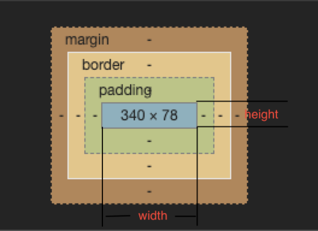
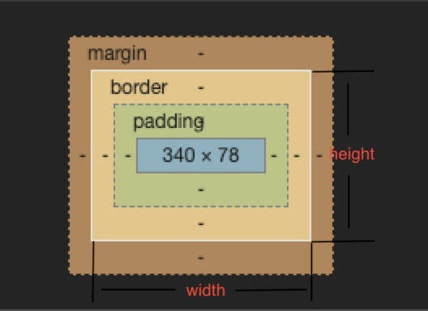

# css3相关

## BFC及其工作原理

### 定义

`BFC`（Block Formatting Context）：**块级格式化上下文**，页面中的一块渲染区域，并且有一套渲染规则，它决定了其子元素将如何定位，以及和其他元素的关系和相互作用

### BFC的规则

- BFC内部的Box盒子会在垂直方向，一个接一个地放置
- Box垂直方向的距离由margin决定，**属于同一个BFC的两个相邻Box的垂直margin会发生重叠**
- 每个元素的margin box的左边， 与包含块border box的左边相接触(对于从左往右的格式化，否则相反)。即使存在浮动也是如此
- BFC的区域不会与浮动盒子float box重叠
- BFC就是页面上的一个隔离的独立容器，容器里面的子元素不会影响到外面的元素。反之也如此
- 计算BFC的高度时，浮动元素也参与计算

### 如何生成BFC

属性| 值
---|---
根元素html | `html`标签就是一个`BFC`s
float | `left`、`right`(`不为none)
position | `absolute`、`fixed`、`sticky`等（不为static或relative）
display | 值为`inline-block`, `table-cell`, `table-caption`, `flex`, `inline-flex`
overflow | `hidden`、`auto`、`scroll`等（不为visible）

### BFC的作用

- 分属于不同的`BFC`时可以**阻止margin重叠**
- 避免浮动元素和其他元素重叠
- 清除内部浮动

参考[深入理解BFC](https://www.cnblogs.com/xiaohuochai/p/5248536.html)，可以演示效果

## 盒模型

### 概念

1. [概念](https://developer.mozilla.org/zh-CN/docs/Web/CSS/CSS_Box_Model/Introduction_to_the_CSS_box_model)


2. 说明：（四个部分）

- 内容边界**content**（通过 `width`、`min-width``max-width`、`height`、`min-height`，和 `max-height` 控制）
- 内边距边界**padding**（`padding-top`、`padding-right`、`padding-bottom`、`padding-left`，和简写属性 `padding` 控制）
- 边框边界**border**（边框的粗细由 `border-width` 和简写的 `border` 属性控制）
- 外边框边界**margin**（由 `margin-top`、`margin-right`、`margin-bottom`、`margin-left`，和简写属性 `margin` 控制）

### 标准盒模型与IE模盒型

概念 | 设置模型 | 说明
---|---|---
<div style="width: 80px">标准盒模型</div> | <div style="width: 350px">`box-sizing: content-box;`（默认值）</div> <br> width和height是对**content**设置 | 
IE模型 | `box-sizing: border-box;` 怪异盒模型 <br> width和height是对**content+padding+border**设置 | 

::: tip
1. 如果不想因为改变padding的时候盒子的大小也会跟着变化的话，可以使用怪异盒模型
2. 如果想让盒子的大小被padding撑开的话，可以使用标准盒模型
:::

### JS如何设置获取盒模型对应的宽和高

```js
dom.style.width/height  // 只能取内联样式的宽高
dom.currentStyle.width/height // 只有ie支持
window.getComputedStyle(dom).width/height
dom.getBoundingClientRect().width/height
```

## 清除浮动

1. 额外标签法：给谁清除浮动，就在其后面额外增加一个个空白标签，并设置样式为设置`clear: both`
2. 创建BFC：父级添加样式`overflow: hidden`
3. 浮动元素使用after伪元素，如何设置：

```css
.clearfix:after{
    content: "";
    display: block;
    clear: both;
    height: 0;
    visibility: hidden;
}
.clearfix{
    *zoom: 1;/*ie6清除浮动的方式 *号只有IE6-IE7执行，其他浏览器不执行*/
}

```

4. 使用`before`和`after`双伪元素清除浮动

```css
.clearfix:after,.clearfix:before{
    content: "";
    display: table;
}
.clearfix:after{
    clear: both;
}
.clearfix{
    *zoom: 1;
}
```

## display:none、visibile:hidden、opacity:0的区别

类型|是否隐藏 | 是否在文档中占用空间 | 是否会触发事件
---|---|---|---
display:none | 是 | 否 | 否
visibile:hidden | 是 | 是 | 否
opacity:0 | 是 | 是 | 是

## 水平垂直居中的方式

1. flex

```css
// 父容器
display: flex;
justify-content: center;
align-items: center;
```

2. position

```css
// 父容器
position: relative;

// 子容器
position: absolute;
margin: auto;
top: 0;
bottom: 0;
left: 0;
right: 0;
```

3. position + transform

```css
// 父容器
position: relative;

// 子容器
position: absolute;
top: 50%;
left: 50%;
transform: translate(-50%, -50%);
```

> transform还有其他的属性:
>
> 1. 转换: translate(x,y), translateX(x), translateY(y), translateZ(z), translate3d(x,y,z)
> 2. 缩放: scale((x,y), scaleX(x), scaleY(y), scaleZ(z), scale3d((x,y,z)
> 3. 旋转: rotate(angle), rotateX(angle), rotateY(angle), rotateZ(angle), rotate3d(x,y,z,angle)
> 4. 倾斜: skew(x-angle,y-angle),skewX(angle), skewY(angle)
> 5. 透视: perspective(n)

4. table-cell

```html
<div class="box">
    <div class="content">
        <div class="inner"></div>
    </div>
</div>
```

```css
html, body {
    height: 100%;
    width: 100%;
    margin: 0;
}
.box {
    display: table;
    height: 100%;
    width: 100%;
}
.content {
    display: table-cell;
    vertical-align: middle;
    text-align: center;
}
.inner {
    background-color: #000;
    display: inline-block;
    width: 200px;
    height: 200px;
}
```

## 文本超出部分显示省略号

单行

```css
overflow: hidden;
text-overflow: ellipsis;
white-space: nowrap;
```

多行

```css
display: -webkit-box;
-webkit-box-orient: vertical;
-webkit-line-clamp: 3; // 最多显示几行
overflow: hidden;
```

## 页面布局

### 三栏布局

假设高度已知，请写出三栏布局，其中左栏，右栏宽度各300px，中间自适应

5种方案：

- flex布局
- 绝对定位布局absolute
- 浮动布局float
- 表格布局table
- 网格布局grid

### flex布局

```css
.content{
    display: flex;
}
.left {
    width: 300px;
}
.right {
    width: 300px;
}
.center {
    flex: 1;
}
```

### 绝对定位布局absolute

```css
.left,.right,.center {
    position: absolute;
}
.left {
    left: 0;
    width: 300px
}
.right {
    right: 0;
    width: 300px;
}
.center {
    left: 300px；
    right: 300px;
}
```

### 浮动布局float

```css
.left {
    float: left;
    width: 300px;
}
.right {
    float: right;
    width: 300px;
}
```

### 表格布局table

```css
.content {
    width: 100%;
    display: table;
    height: 100px;
}
.left,.right,.center {
    display: table-cell;
}
.left {
    width: 300px;
}
.right {
    width: 300px;
}
```

### 网格布局grid

```css
.content {
    display: grid;
    width: 100%;
    grid-template-rows: 100px;
    grid-template-columns: 300px auto 300px;
}
```

延伸：

1. 五种方案的优缺点：

- float: 需要清除浮动，因为浮动脱落文档流，优点是兼容性好
- 绝对定位：快捷，缺点：
- flex: 解决上述两个布局方式的问题
- 表格布局：兼容性好，缺点：
- 网格布局：css3新出的布局方式

2. 高度未知情况，哪个不再适用：

    float，绝对定位，网格布局不行，只有表格布局和flex布局通用

3.  兼容性如何，哪个最实用 ：

4. 页面布局的变通：

- 三栏布局：
    - 左右宽度固定，中间自适应
    - 上下高度固定，中间自适应（h5布局常用）
- 两栏布局
    - 左宽度固定，右自适应
    - 右宽度固定，左自适应
    - 上高度固定，下自适应
    - 下高度固定，上自适应