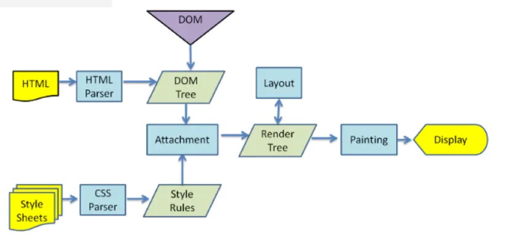

# html5相关

## html5

- 标签语义化
  - 合理、正确的利用标签，来展示内容页面
  - 有利于阅读和页面结构的清晰
  - 有利于SEO
  - 有利于开发和维护  
- 音视频处理
- canvas/webGL
- history API
- requestAnimationFrame
- 地理位置
- web socket

## 浏览器中输入url回车发生了什么

1. 对URL地址进行DNS域名解析找到对应的IP地址
2. 建立TCP连接（三次握手）
3. 浏览器发送HTTP请求报文
4. 服务器返回HTTP响应报文
5. 关闭TCP连接（四次挥手）
6. 浏览器解析文档资源并渲染页面

## 浏览器的渲染过程

webkit渲染的主要过程:



1. `解析HTML生成DOM树`：当浏览器接收到服务器响应来的HTML文档后，会遍历文档节点，HTML Parser将HTML标记解析成DOM Tree
2. `解析CSS生成CSSOM规则树`：CSS Parse将每个CSS文件都被解析成一个StyleSheet对象，每个对象都包含Style Rules，Style Rules也叫CSSOM（CSS Object Model）
3. `将DOM树与CSSOM规则树合并在一起生成RenderTree渲染树`：Render Tree的构建其实就是DOM Tree和CSSOM Attach的过程(每个 DOM 节点都有一个“attach”方法)
5. `遍历渲染树开始布局，计算每个节点的位置、大小（Layout(回流）`：创建渲染树后，下一步就是布局（Layout）,或者叫回流（reflow），这个过程就是通过渲染树中渲染对象的信息，计算出每一个渲染对象的位置和尺寸，将其安置在浏览器窗口的正确位置，而有些时候我们会在文档布局完成后对DOM进行修改，这时候可能需要重新进行布局，也可称其为回流，本质上还是一个布局的过程，每一个渲染对象都有一个布局或者回流方法，实现其布局或回流。
6. `将渲染树每个节点绘制到屏幕`：在绘制阶段，系统会遍历渲染树，并调用渲染器的“paint”方法，将渲染器的内容显示在屏幕上

::: tip 说明

- 在构建DOM Tree的过程中可能会被css或者js的加载而执行阻塞
- 解析dom和解析css同时进行，但是与script执行是互斥的

:::

## 浏览器的回流Reflow与重绘Repaint

1. 当涉及到DOM节点的**布局属性**发生变化（规模尺寸、布局、隐藏等改变）时，就会重新计算render tree，浏览器会重新描绘相应的元素，此过程叫**Reflow（回流或重排）**
2. 当影响DOM元素**可见性的属性**发生变化（外观或外观可见性（visibility）时, 浏览器会重新描绘相应的元素, 此过程称为**Repaint（重绘）**。因此**回流必然会引起重绘**

触发回流：
    
- 页面首次渲染
- 浏览器窗口大小发生改变
- 元素尺寸或位置发生改变
- 元素内容变化（文字数量或图片大小等等
- 元素字体大小变化、
- 增加、删除、修改DOM结点时，会导致Reflow和repaint
- 激活CSS伪类

触发重绘：
    
- 修改color/background-color/visibility

如何避免：

css

- 避免使用table布局。
- 尽可能在DOM树的最末端改变class。
- 避免设置多层内联样式。
- 将动画效果应用到position属性为absolute或fixed的元素上。
- 避免使用CSS表达式（例如：calc()）

js

- 避免频繁操作样式，最好一次性重写style属性，或者将样式列表定义为class并一次性更改class属性。
- 避免频繁操作DOM，创建一个documentFragment，在它上面应用所有DOM操作，最后再把它添加到文档中。
- 也可以先为元素设置display: none，操作结束后再把它显示出来。因为在display属性为none的元素上进行的DOM操作不会引发回流和重绘。
- 避免频繁读取会引发回流/重绘的属性，如果确实需要多次使用，就用一个变量缓存起来。
- 对具有复杂动画的元素使用绝对定位，使它脱离文档流，否则会引起父元素及后续元素频繁回流。

## href和src区别

- `href`（Hypertext Reference）标记超文本引用，用在link和a标签等元素上，用来建立当前元素和文档之间的链接，浏览器解析时会标记该文档为css文档，并行下载资源并且不会停止对该文档的处理（这是为什么建议使用link方式加载css，而不是使用@import）
- `src`表示引用资源，替换当前元素，用在img，script，iframe等上，当浏览器解析到src时，会暂停其他资源的下载和处理（图片不会暂停其他资源的下载和处理），直到将该资源加载、编译、执行完毕，图片和框架等也如此，类似于将所指向资源应用到当前内容。（这也是为什么建议把 js 脚本放在底部而不是头部的原因）

## img标签中的`alt`和`title`属性的作用

- `alt`：如果无法显示图像，浏览器将显示alt指定的内容
- `title`：在鼠标移到元素上时显示title的内容

## DOCTYPE的作用

`DOCTYPE`（document type 文档类型）的作用:
- 告诉浏览器的解析器使用哪种HTML规范或者XHTML规范来解析页面（**声明文档类型**）
- DTD规范

> DTD（document type defination，文档类型定义）是一系列的语法规则，用来定义XML或(X)HTML的文件类型。浏览器会使用它来判断文档类型，决定使用何种协议来解析，以及切换浏览器模式。（告诉浏览器当前文档是什么文档类型，浏览器使用相应的引擎来解析和渲染）

常见的DOCTYPE有哪些？

- HTML5

```html
<!DOCTYPE html>
```

- HTML4.01 Strict（严格模式）

该DTD包含所有HTML元素和属性，但是不包含展示类的和弃用类的元素（比如font）

```html
<!DOCTYPE HTML PUBLIC "-//W3C//DTD HTML 4.01//EN" "http://www.w3.org/TR/html4/strict.dtd">
```

- HTML4.01 Transitional（传统模式）

该DTD包含所有HTML元素和属性，包含展示类的和弃用类的元素（比如font）

```html
<!DOCTYPE HTML PUBLIC "-//W3C//DTD HTML 4.01 Transitional//EN" "http://www.w3.org/TR/html4/loose.dtd">
```

## Canvas与SVG的区别

### SVG

- SVG 指可伸缩矢量图形 (Scalable Vector Graphics)
- 适合做google地图，因为是矢量图，缩放不影响显示
- 用svg标签，里面可以是circle标签

```xml
<svg width="100%" height="100%"  >
  <circle cx="300" cy="60" r="50" stroke="#ff0" stroke-width="3" fill="red" />
</svg>
```

- SVG 是一种使用 XML 描述 2D 图形的语言
- SVG 基于 XML，这意味着 SVG DOM 中的每个元素都是可用的。您可以为某个元素附加 JavaScript 事件处理器
- 在 SVG 中，每个被绘制的图形均被视为对象。如果 SVG 对象的属性发生变化，那么浏览器能够自动重现图形

特点：

- 不依赖分辨率
- 支持事件处理器
- 最适合带有大型渲染区域的应用程序（比如谷歌地图）
- 复杂度高会减慢渲染速度（任何过度使用 DOM 的应用都不快）
- 不适合游戏应用

### Canvas

- Canvas 通过 JavaScript 来绘制 2D 图形
- Canvas 是逐像素进行渲染的
- 在 canvas 中，一旦图形被绘制完成，它就不会继续得到浏览器的关注。如果其位置发生变化，那么整个场景也需要重新绘制，包括任何或许已被图形覆盖的对象

特点：

- 依赖分辨率
- 不支持事件处理器
- 弱的文本渲染能力
- 能够以 .png 或 .jpg 格式保存结果图像
- 最适合图像密集型的游戏，其中的许多对象会被频繁重绘

### 对比简述

都是2D做图，svg是矢量图，canvas是位图。Canvas 是逐像素进行渲染的，适合游戏
