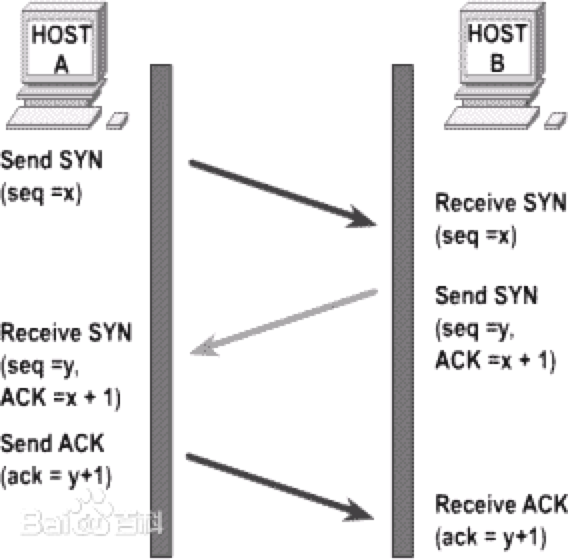
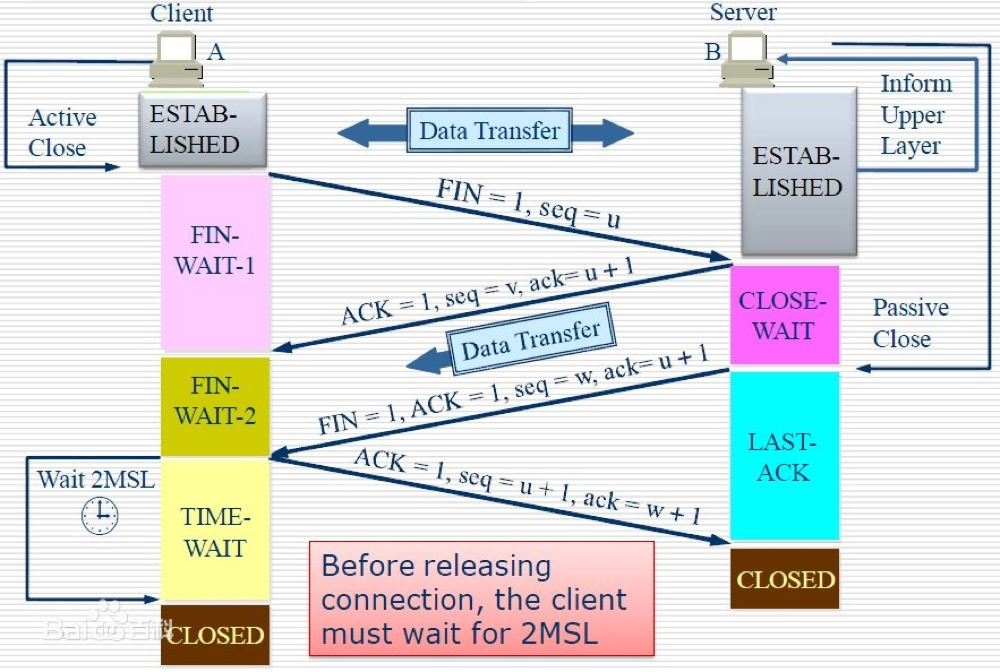

## HTTP协议的主要特点

- 无连接：连接一次就会断开，不会保持连接
- 无状态：两次连接不会区分用户身份和状态
- 简单快速：访问资源（图片，页面）通过输入简单的uri连接即可
- 灵活：通过一个http协议可以完成不同类型数据的传输

## HTTP报文的组成部分

(1)请求报文（Request Headers）：

分类 | 说明
---|---
请求行 | GET / HTTP/1.1
请求头 | Host：www.imooc.com...（一系列的key-value值）
空行 | 用来告诉服务器，下面的是请求体
请求体 | 数据部分

(2)响应报文：

分类 | 说明
---|---
状态行 | HTTP/1.1 200 OK
响应头 | Server: ngix...（一系列的key-value值）
空行 |
响应体 |

## HTTP请求的方法

方法 | 说明
---|---
GET | 获取资源
POST | 传输资源
HEAD | 获取报文首部
PUT | 更新资源
DELETE | 删除资源
CONNECT | HTTP/1.1 协议中预留给能够将连接改为管道方式的代理服务器
OPTIONS | 用于获取目的资源所支持的通信选项
TRACE | 回显服务器收到的请求，主要用于测试或诊断
PATCH | 是对 PUT 方法的补充，用来对已知资源进行局部更新

## POST个GET的区别（记住三到四个）

- [x] GET参数通过URL传递，POST放在Request body中
- [x] GET请求参数会被完整保留在浏览器历史记录里，而POST中的参数不会保留
- [x] GET请求在URL中传送的参数是有长度限制的，而POST没有限制
- [x] GET在浏览器回退时是无害的，而POST会再次请求
- [x] GET请求会被浏览器主动缓存，而POST不会，除非手动设置
- GET产生的URL地址可以被隐藏，而POST不可以
- GET请求只能进行url编码，而POST支持多种编码方式
- 对于参数的数据类型，GET只接受ASCII字符，而POST没有限制
- GET比POST更不安全，因为参数直接暴露在URL上，所以不能用来传递敏感信息

## HTTP状态码

状态码 | 说明
---|---
1xx | 指示信息 - 表示请求已接收，继续处理
2xx | 成功 - 表示请求已被成功接收
3xx | 重定向 - 要完成请求必须进行更进一步的操作
4xx | 客户端错误 - 请求有语法错误或者请求无法实现
5xx | 服务器错误 - 服务器未能实现合法的请求

200 OK：客户端请求成功

206 Partial Content：客户端发送了一个带有Range头的GET请求，服务端完成了它(比如音频文件太大)

301 Moved Permanently：所请求的页面已经转移至新的url

302 Found：所请求的页面已经临时转移至新的url

304 Not Modified：客户端有缓存的文档并发出了一个条件性的请求，服务端告诉客户端原来缓存的文档还可以继续使用

400 Bad Request：客户端请求有语法错误，不能被服务器所理解

401 Unauthorized：请求未经授权，这个状态码必须和WWW-Authenticate报头域一起使用

403 Forbidden：对被请求页面的访问被禁止

404 Not Found：请求资源不存在

500 Internal Server Error：服务器发生了不可预期的错误原来缓冲的文档可以继续使用

503 Service Unavailable：请求未完成，服务器临时过载或宕机，一段时间后可恢复正常

## 什么是持久连接：每个连接可以处理多个请求-响应事务

HTTP协议采用“请求-应答”模式，当使用普通模式，即非Keep-Alive模式时，每个请求/应答客户端和服务器都要建立一个连接，完成之后立即端口连接（HTTP协议为无连接的协议）

当使用Keep-Alive模式（又称持久连接、连接重用）时，Keep-Alive功能使客户端到服务器端的连接持续有效，当出现对服务器的后继请求时，Keep-Alive功能避免了建立或者重新建立连接（HTTP/1.0不支持，HTTP/1.1支持）

## 什么是管线化

通常，http请求总是顺序发送的，下一个请求只有在当前请求的响应被完全接受的时候才会被发送，在使用持久连接的情况下，某个连接上消息的传递类似于：请求1->响应1->请求2->响应2->请求3->响应3

HTTP/1.1允许多个http请求通过一个套接字同时被输出 ，而不用等待相应的响应。某个连接上的消息变成了类似这种样子：请求1->请求2->请求3->响应1->响应2->响应3

特点：

管线化机制通过持久连接完成，仅HTTP/1.1支持此技术

只有GET和HEAD请求可以进行管线化，而POST有所限制

创建连接时不应启动管线化机制，因为服务器不一定支持HTTP/1.1版本的协议

## http和https的区别

概念：

- HTTP：超文本传输协议（HyperText Transfer Protocol）
- HTTPS：超文本传输安全协议（Hypertext Transfer Protocol Secure）HTTPS经由HTTP进行通信，但利用SSL/TLS来加密数据包。HTTPS开发的主要目的，是提供对网站服务器的身份认证，保护交换数据的隐私与完整性

http的缺点：

- http协议的所有传输内容都是明文，即便是自己加密了，但是加密的内容也依旧是明文，这就避免不了被窃听！
- http协议传输的过程中没有身份验证这一说，这样就不免半路杀出一个不明身份就行身份冒充！
- http协议传输的过程中也并没有进行数据完整性的校验，不免有些人在中途进行内容篡改！

区别：

1. https协议需要到ca申请证书，一般免费证书较少，因而需要一定费用。

2. http是超文本传输协议，信息是明文传输，https则是具有安全性的ssl加密传输协议。

3. http和https使用的是完全不同的连接方式，用的端口也不一样，前者是80，后者是443。

4. http的连接很简单，是无状态的；HTTPS协议是由SSL+HTTP协议构建的可进行加密传输、身份认证的网络协议，比http协议安全。

## 简述https原理，以及与http的区别
## 操作系统中进程和线程怎么通信
## 你知道哪些http头部

## TCP三次握手四次挥手

TCP是传输层协议，使用三次握手协议建立连接

TCP三次握手的过程：

- 客户端发送`syn（syn=j）包`给服务器端，进入`SYN_SEND状态`，等待服务器的确认
- 服务器收到syn包，必须确认客户的syn（ack=j+1），同时自己也发送一个SYN包（syn=k），即`SYN+ACK包`，此时服务器进入`SYN_RECV状态`
- 客户端收到服务器的`SYN+ACK`包，向服务器发送确认`包ACK(ack=k+1)`，此包发送完毕，客户端和服务器进入`ESTABLISHED`状态，完成三次握手

三次握手完成，TCP客户端和服务器端成功的建立连接，可以开始传输数据了。

连接终止需要四次挥手：

- 客户端A发送一个`FIN`，用来关闭客户A到服务器B的数据传送
- 服务器B收到这个FIN，它发回一个`ACK`，确认序号为收到的序号加1（报文段5）。和SYN一样，一个FIN将占用一个序号。
- 服务器B关闭与客户端A的连接，发送一个`FIN`给客户端A
- 客户端A发回ACK报文确认，并将确认序号设置为收到序号加1
  
## TCP为什么建立连接协议是三次握手，而关闭连接却是四次握手

因为服务端的`LISTEN`状态下的`SOCKET`当收到SYN报文的建连请求后，它可以把`ACK和SYN`（ACK起应答作用，而SYN起同步作用）放在一个报文里来发送。但关闭连接时，当收到对方的FIN报文通知时，它仅仅表示对方没有数据发送给你了；但未必你所有的数据都全部发送给对方了，所以你可以未必会马上会关闭SOCKET,也即你可能还需要发送一些数据给对方之后，再发送FIN报文给对方来表示你同意可以关闭连接了，所以它这里的ACK报文和FIN报文多数情况下都是分开发送的