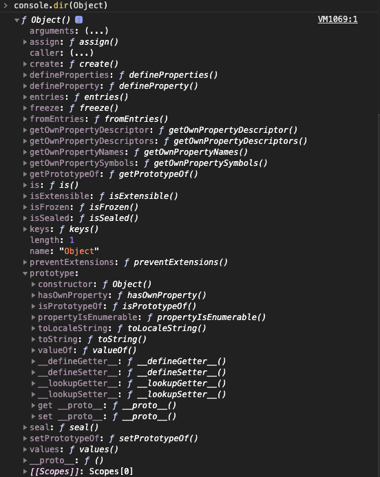

# 原型链

## 原型对象

原型对象 | 说明 | 值
---|---|---
显式原型对象`prototype` | 所有**函数**都有一个`prototype`属性 | 对象
隐式原型对象`__proto__` | 所有**引用类型**都有一个私有属性`__proto__` | 对象

::: tip

- 所有**引用类型**的`__proto__`属性指向它**构造函数**的原型对象（`prototype`）
- 根据定义，`null` 没有原型，并作为这个原型链中的最后一个环节

:::

## 构造函数

在 JavaScript 中，构造器其实就是一个普通的函数。当使用 new 操作符 来作用这个函数时，它就可以被称为构造函数

## 原型链

原型链：

- 当访问一个对象的某个属性时，会先在这个对象本身属性上查找
- 如果没有找到，则会去它的`__proto__`隐式原型上查找，即它的构造函数的`prototype`
- 如果还没有找到就会再在`构造函数的prototype的__proto__`中查找
- 这样一层一层向上查找就会形成一个链式结构，我们称为原型链

## 创建对象有几种方法

### 字面量方法

```js
// {}
var o1 = {name: 'o1'}
// new Object()
var o2 = new Object({name: 'o2'}) // 也可以理解为通过构造函数来创建对象
```

### 构造函数

```js
var M = function(name){this.name = name}
var o3 = new M('o3')
```

### Object.create()

```js
// Object.create(),创建一个对象并继承原型对象
var p = {name: 'p'}
var o4 = Object.create(p)
// o4.__proto__ === p
```

::: tip

Object.create(null) 创建的对象是一个空对象，在该对象上没有继承 Object.prototype 原型链上的属性或者方法

:::

## 原型、构造函数、实例、原型链的关系


说明：

1. **构造函数** 的 **原型对象prototype** 的 **构造函数constructor** 等于 **构造函数**

```js
Object.prototype.constructor === Object
```

2. **构造函数** 的 **原型对象prototype** 等于 **构造函数实例** 的 `__proto__`

```js
Object.prototype === new Object().__proto__
```

## instanceof的原理

```js
function Car(make, model, year) {
  this.make = make;
  this.model = model;
  this.year = year;
}
const auto = new Car('Honda', 'Accord', 1998);
// auto.__proto__ === Car.prototype
console.log(auto instanceof Car);
// auto.__proto__.__proto__ === Object.prototype
console.log(auto instanceof Object);
```

::: tip

- 判断实例的隐式原型对象`__proto__`和构造函数的显示原型对象`prototype`是否是同一个引用
- 或者 判断实例的`隐式函数`与构造函数的`显式函数`是否是同一引用

:::

图解：




## new运算符

问题：理解创建一个对象如何关联上一个实例对象？

原理：

1. 创建一个新对象（空对象），继承构造函数的原型对象（foo.prototype）
2. 构造函数foo被执行。执行的时候，相应的传参会被传入，同时上下文（this）会指定为这个新的实例。new foo等同于new foo()，只能用于在不传任何参数的情况
3. 如果构造函数返回一个“对象”，那么这个对象会取代整个new出来的结果。如果构造函数没有返回对象，那么new出来的结果为步骤1创建的对象

问题：如何模拟new运算符？

```js
var new2 = function(func) { // 参数构造函数
    // 第一步：创建一个新对象，继承构造函数的原型对象
    // 即创建对象o，继承构造函数的原型对象：o.__proto__ === func.prototype
    var o = Object.create(func.prototype)
    // 第二步：执行构造函数，转移this到o对象上
    var k = func.call(o)
    // 判断构造函数执行的结果是不是对象类型
    if (typeof k === 'object'){
        return k
    } else {
        return o
    }
}
// 验证
var o6 = new2(M)
o6 instanceof M // 判断o6是不是M构造函数的实例
o6 instanceof Object 
o6.__proto__.construtor === M // o6的原型对象是否等于M
M.prototype.walk = function(console.log('walk')) // 在M的原型上增加一个方法walk
o6.walk()
```

## 类与实例

面向对象类OOP：面向对象程序设计(Object Oriented Programming)

1. 类的声明

```js
// es5 构造函数
function Animal() {
    this.name = 'name'
}
// es6 class
class Animal2 {
    constructor() {
        this.name = ''
    }
}
```

::: warning

- class 只是语法糖，本质还是函数
- `Animal2 instanceof Function // 返回 true`

:::

2. 生成实例（通过类实例化生成对象）

```js
new Animal()
new Animal2()
```

## 类与继承

如何实现继承：

当试图得到一个对象的某个属性时，如果这个对象本身没有这个属性，那么会去它的`__proto__`(即构造函数的prototype)中去找（通过`原型链`实现继承）

## 继承的几种方式

### 1. 借助构造函数实现继承

方法：子类构造函数中执行父类构造函数（` Parent.call(this) `）

缺点：继承不了父类构造函数原型对象`（Parent.prototype）`上的属性和方法

```js
function Parent() {
    this.name = 'Parent1'
}
// 缺点：继承不了父类`原型对象（Parent.prototype）`上的属性和方法
Parent.prototype.say = function() {}
function Child() {
    Parent.call(this) // 或者使用apply
    this.type = 'Child'
}
// 实例化Child1
console.log(new Child)
```

### 2. 借助原型链实现继承：弥补通过构造函数继承的缺点

方法：将父类构造函数的实例赋值给子类构造函数的原型对象（`Child.prototype = new Parent()`）

原因：子类Child.prototype赋值父类的实例new Parent()，当子类实例化时，`子类实例的__proto__`就等于`子类构造函数的prototype`，`子类实例的__proto__`等于`父类的实例`，因此实现了继承

缺点：如果实例化两个子类构造函数，其中一个子类构造函数的原型上的方法和属性改变，另一个实例也会相应改变

```js
function Parent() {
    this.name = 'Parent2'
    this.play = [1,2,3]
}
function Child() {
    this.type = 'Child2'
}
Child.prototype = new Parent()
// 实例化Child1
console.log(new Child)

// 缺点：改变s1原型对象上的属性和方法会影响到s2对象，原因是s1和s2的__proto__的指向相同（s1.__proto__ === s2.__proto__）
var s1 = new Child()
var s2 = new Child()
console.log(s1.play,s2.play)
s1.play.push(4)
console.log(s1.play,s2.play)
```

### 3. 组合方式,组合构造函数和原型链两种方式

方法：

- 在子类构造函数中执行父类构造函数，
- 然后将父类的构造函数的实例赋值给子类的原型对象

缺点：父类构造函数执行了两次

```js
function Parent() {
    this.name = 'Parent3'
    this.play = [1,2,3]
}
function Child() {
    Parent.call(this) 
    this.type = 'Child3'
}
// 缺点：父级的构造函数执行了两次
Child.prototype = new Parent()
var s3 = new Child()
var s4 = new Child()
s3.play.push(4)
console.log(s3.play,s4.play)
```

### 4. 优化方式1: 通过父类的prototype

方法：

- 子类构造函数中执行父类构造函数，
- 然后将父类构造函数的原型对象赋值给子类构造函数的原型对对象

缺点：区分不了一个对象是子类的实例化还是父类的实例化

```js
function Parent() {
    this.name = 'Parent4'
    this.play = [1,2,3]
}
function Child() {
    Parent.call(this)
    this.type = 'Child4'
}
// 缺点：区分不了一个对象是一个子类的实例化还是一个父类的实例化
Child.prototype = Parent.prototype
var s5 = new Child()
var s6 = new Child()
console.log(s5, s6)
console.log(s5 instanceof Child) // true
console.log(s5 instanceof Parent) // true
```

### 5. 优化方式2：通过Object.create()

方法：

- 在子类构造函数中执行父类构造函数，
- 然后创建父类构造函数的实例继承赋值给子类构造函数的原型对象，
- 最后将子类构造函数赋值给子类构造函数的原型对象的constructor

```js
function Parent()
    this.name = 'Parent5'
    this.play = [1,2,3]
}
function Child() {
    Parent.call(this)
    this.type = 'Child5'
}
Child.prototype = Object.create(Parent.prototype)
Child.prototype.constructor = Child

var s7 = new Child()
console.log(s7 instanceof Child, s7 instanceof Parent)
console.log(s5.constructor)
```

### 6. 使用es6的extends

```js
class Parent {
    constructor(value) {
    this.val = value
    }
    getValue() {
    console.log(this.val)
    }
}
class Child extends Parent {
    constructor(value) {
    super(value) // Parent.call(this, value)
    this.val = value
    }
}
let child = new Child(1)
child.getValue() // 1
child instanceof Parent // true
```

拓展：

**Object.prototype.toString**方法

```js
console.log(Object.prototype.toString.call("jerry"));   //[object String]
console.log(Object.prototype.toString.call(12));        //[object Number]
console.log(Object.prototype.toString.call(true));     //[object Boolean]
console.log(Object.prototype.toString.call(undefined));  //[object Undefined]
console.log(Object.prototype.toString.call(null));      //[object Null]
console.log(Object.prototype.toString.call({name: "jerry"}));  //[object Object]
console.log(Object.prototype.toString.call(function(){}));    //[object Function]
console.log(Object.prototype.toString.call([]));        //[object Array]
console.log(Object.prototype.toString.call(new Date));   //[object Date]
console.log(Object.prototype.toString.call(/\d/));   //[object RegExp]
function Person(){};
console.log(Object.prototype.toString.call(new Person));//[object Object]
```
