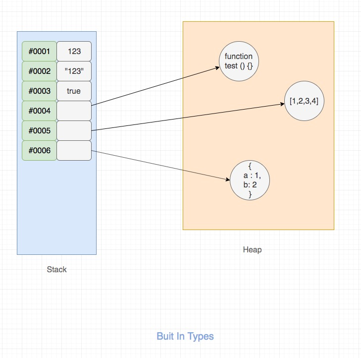

# 作用域和闭包

## 内置类型

JS内置类型有两种：

类型 | 数据类型 | 存储
---|---|---
原始类型（又叫基本类型） | `string`、`number`、<br>`boolean`、`null`、<br>`undefined`、`symbol`（ES6新增）| 栈(stack)
引用类型 | `object` | 堆(heap)

JS数据类型存储图解：



- 其实类型指的是值的类型，不是变量的类型
- 对于 JS 这种动态类型的语言来说， 我们无法给变量限定类型，变量的类型是可变的

比如：

```js
var a = 1;
typeof a; // "number"

a = {};
typeof a; // "object"
```

## 作用域

### 定义

- 作用域是一个变量和函数的作用范围
- JS中函数内声明的所有变量在函数体内始终是可见的
- 在ES6前有**全局作用域**和**局部作用域**，但是没有块级作用域（catch只在其内部生效）
- 局部变量的优先级高于全局变量

::: tip

- 函数提升优先于变量提升，函数提升会把整个函数挪到作用域顶部，变量提升只会把声明挪到作用域顶部
- var 存在提升，我们能在声明之前使用。let、const 因为暂时性死区的原因，不能在声明前使用
- var 在全局作用域下声明变量会导致变量挂载在 window 上，其他两者不会
- let 和 const 作用基本一致，但是后者声明的变量不能再次赋值

:::

## 作用域链

当访问一个变量时，解释器会首先在当前作用域查找标示符，如果没有找到，就去父作用域找，直到找到该变量的标示符或者不在父作用域中，这就是作用域链。

作用域链和原型继承查找时的区别：如果去查找一个普通对象的属性，但是在当前对象和其原型中都找不到时，会返回undefined；但查找的属性在作用域链中不存在的话就会抛出ReferenceError。

## let、var、const的区别

1. let/const定义的变量不会出现变量提升，而var定义的变量会提升
2. 相同作用域中，let和const不能出现重复声明。而var就可以
3. const后者声明的变量不能再次赋值
4. const声明的引用类型可以更改，因为const声明的引用类型的指针指向的地址不可以改变，指向地址的内容是可以改变的

## 闭包

### 定义

能够访问其他函数内部变量的函数，被称为 闭包

闭包的定义其实很简单:函数 A 内部有一个函数 B，函数 B 可以访 问到函数 A 中的变量，那么函数 B 就是闭包。

在 JS 中，闭包存在的意义就是让我们可以间接访问函数内部的变量。

```js
for (var i = 1; i <= 5; i++) { 
    setTimeout(function() {
        console.log(i)
    }, i * 1000)
}
// 打印多次 6
```

方案一：使用闭包

```js
for (var i = 1; i <= 5; i++) { 
    (function(j) {
        setTimeout(function() { console.log(j)}, j *1000)
    })(i)
}
```

方案二：setTimeout多穿一个参数

```js
for (var i = 1; i <= 5; i++) { 
    setTimeout(function(j) {
         console.log(j)
    },i * 1000, i) 
}
```

方案三：使用let

```js
for (let i = 1; i <= 5; i++) { 
setTimeout(function() {
    console.log(i)
  }, i * 1000)
}
```
