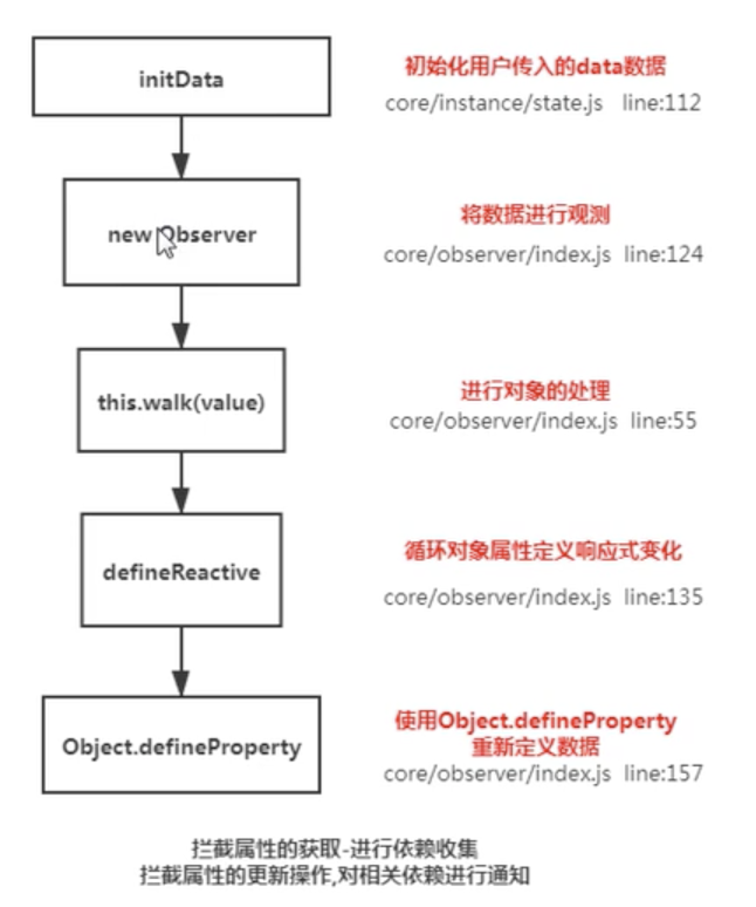

# 响应式原理

简单概述：

vue.js 采用数据劫持结合发布-订阅模式,通过 `Object.defineProperty` 来劫持各个属性的 `setter`,`getter`,在数据变动时发布消息给订阅者,触发响应的监听回调

详细描述：

当创建 Vue 实例时,vue 会遍历 data 选项的属性,利用 `Object.defineProperty` 为属性添加 `getter` 和 `setter` 对数据的读取进行劫持（`getter` 用来依赖收集,`setter` 用来派发更新）,并且在内部追踪依赖,在属性被访问和修改时通知变化。

每个组件实例会有相应的 `watcher` 实例,会在组件渲染的过程中记录依赖的所有数据属性（进行依赖收集,还有 `computed watcher`,`user watcher` 实例）,之后依赖项被改动时,`setter` 方法会通知依赖与此 data 的 watcher 实例重新计算（派发更新）,从而使它关联的组件重新渲染。

## Object.defineProperty的使用

字面理解是：对象定义属性

1. 定义一个对象
```js
let obj = {}
Object.defineProperty(obj, 'school', {
    configurable: true, 
    writable: true, 
    enumerable: true,
    value: '安庆师范大学',
})
console.log(obj)
```

::: tip
1. configurable：可配置属性，默认是false，如果不设置为true，使用delete obj.school删除不了对象属性
2. writable：可写属性，默认是false，如果不设置为true， obj.school = "淮北师范大学" 改变不了对象属性的值
3. enumerable：可枚举属性，默认是false如果不设置为true，使用for...in获取不到对象的属性
4. value：属性的值，通常使用get和set函数来代替value
:::

2. 使用get,set重写value

```js
let obj = {}
Object.defineProperty(obj, 'school', {
    configurable: true,
    enumerable: true,
    get() {
        console.log('获取 obj.school 属性值时，触发')
        return '安庆师范大学'
    },
    set(val) {
        console.log('设置 obj.school 属性值时，触发')
        console.log(val)
    }
})
console.log(obj) // 不会触发get和set
console.log(obj.school) // 触发 get
obj.school = '淮北师范大学' // 触发 set
```
::: warning
get和set不能同时与 value和writable使用，会报错
:::

## 核心实现类：

### Observe

作用是给对象的属性添加 getter 和 setter，用于依赖收集和派发更新


简单实现：
```js
let myVue = new MyVue({
    el: '#app',
    data: {
        school: '安庆师范大学',
        info: {
            name: '小明',
            age: 12
        }
    }
})

function MyVue(options = {}) {
  this.$options = options;
  var data = (this._data = this.$options.data);
  observe(data);

  // 数据代理，用this代理 this._data，可以使用this直接访问data中的属性
  for (let key in data) {
    Object.defineProperty(this, key, {
      enumerable: true,
      get() {
        return this._data[key]; // 会走到Observe方法中的get
      },
      set() {
        this._data[key] = newValue; // 会走到Observe方法中的set
      },
    });
  }
}

// 观察对象
function observe(data) {
  if (typeof data !== "object") return;
  return new Observe(data);
}

function Observe(data) {
  for (let key in data) {
    let val = data[key];
    observe(val); // 递归观察对象
    Object.defineProperty(data, key, {
      enumerable: true,
      get() {
        return val;
      },
      set(newValue) {
        if (newValue === val) {
          return;
        }
        val = newValue;
        observe(newValue); // 深度响应式，更改数据后，新数据没有get set
      },
    });
  }
}

```


### Dep

用于收集当前响应式对象的依赖关系,每个响应式对象包括子对象都拥有一个 Dep 实例（里面 subs 是 Watcher 实例数组）,当数据有变更时,会通过 dep.notify()通知各个 watcher

### Watcher

观察者对象 , 实例分为如下三种：

- 渲染 watcher (render watcher),
- 计算属性 watcher (computed watcher),
- 侦听器 watcher（user watcher）

## Vue2.x数据绑定与响应式数据原理



- 监听data变化
- 组件渲染和更新的流程

Vue在初始化数据时，会使用`Object.defineProperty`重新定义data中的所有属性，当页面使用对应属性时，首先会进行`依赖收集`(收集当前组件的watcher)，如果属性发生变化会通知相关依赖进行更新操作(`发布订阅`)

采用`数据劫持`结合`发布者-订阅者模式`的方式，通过`Object.defineProperty()`来劫持各个属性的`setter`，`getter`，在数据变动时发布消息给订阅者，触发相应的监听回调

具体步骤：

1. 需要observe的数据对象进行递归遍历，包括子属性对象的属性，都加上 setter和getter
这样的话，给这个对象的某个值赋值，就会触发setter，那么就能监听到了数据变化

2. compile解析模板指令，将模板中的变量替换成数据，然后初始化渲染页面视图，并将每个指令对应的节点绑定更新函数，添加监听数据的订阅者，一旦数据有变动，收到通知，更新视图

3. Watcher订阅者是Observer和Compile之间通信的桥梁，主要做的事情是:
1、在自身实例化时往属性订阅器(dep)里面添加自己
2、自身必须有一个update()方法
3、待属性变动dep.notice()通知时，能调用自身的update()方法，并触发Compile中绑定的回调，则功成身退。

4. MVVM作为数据绑定的入口，整合Observer、Compile和Watcher三者，通过Observer来监听自己的model数据变化，通过Compile来解析编译模板指令，最终利用Watcher搭起Observer和Compile之间的通信桥梁，达到数据变化 -> 视图更新；视图交互变化(input) -> 数据model变更的双向绑定效果。

## Vue3.x响应式数据原理

Vue3.x改用`Proxy`替代`Object.defineProperty`。因为`Proxy`可以直接监听对象和数组的变化，并且有多达13种拦截方法。并且作为新标准将受到浏览器厂商重点持续的性能优化

### Object.defineProperty()

缺点：

- 无法检测到对象属性的新增或删除，解决方案：Vue.set(obj, propertName/index, value),Vue.delete()
- 不能监听数组的变化，因此vue重写了数组操作的方法，比如push，pop，shift，unshift，splice，sort，reverse

Proxy是ES6提供的一个新的API，用于修改某些操作的默认行为

- Proxy直接代理整个对象而非对象属性
- Proxy也可以监听数组的变化

## Proxy只会代理对象的第一层，那么Vue3又是怎样处理这个问题的

判断当前`Reflect.get`的返回值是否为`Object`，如果是则再通过`reactive`方法做代理， 这样就实现了`深度观测`


## 实现a===1 && a===2 && a===3返回true

```js
var  _a = 1;
Object.defineProperty(this,'a',{
    get:function(){
        return _a++
    }
})
console.log(a===1 && a===2 && a===3)
```