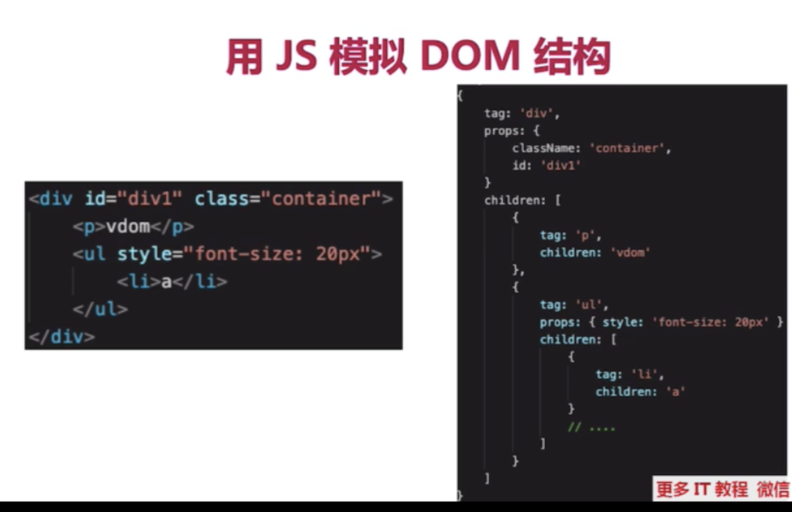
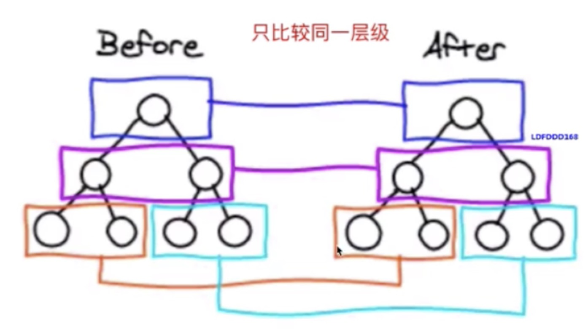
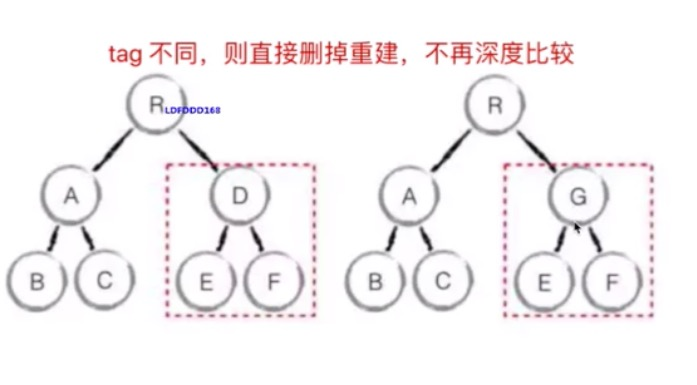

# 渲染

## 模板编译

### js的`with`语法

```js
const obj = {a: 1, b: 2}
console.log(obj.a)
console.log(obj.b)
console.log(obj.c) // undefined

// 使用width，能改变{}内自由变量的查询方式
// 将 {} 内自由变量，当做 obj 的属性来查找
// 慎用，它打破了作用域规则，易读性变差
with(obj) {
  console.log(obj.a)
  console.log(obj.b)
  console.log(obj.c) // 报错
}
```

## 描述vue组件是如何渲染和更新过程


初次渲染：
- 解析模板为render函数
- 触发响应式，监听data属性getter setter(只有模板中使用了数据，该数据才会触发get)
- 执行render函数，生成vnode，patch(elem, vnode)
- patch(elem, vnode)挂在节点
  
更新过程：
- 修改data，触发setter
- 重新执行render函数，生成newVnode
- patch(vnode, newVnode)，diff算法比较差异

## 虚拟DOM

### 什么是虚拟DOM

用JavaScript的树形结构对象来描述真实dom结构



### 什么是 diff 算法

比对(diff)渲染更新前后产生的两个虚拟dom对象的差异，并产出差异补丁对象，再将差异补丁对象应用到真实dom节点上

- 只比较同一层级，不跨级比较



- tag不相同，则直接删除掉，不再深度比较



- tag和key，两者都相同，则认为是相同节点，不再深度比较

### 再说一下虚拟Dom以及key属性的作用

虚拟Dom的产生原因：由于在浏览器中操作DOM是很昂贵的。频繁的操作DOM，会产生一定的性能问题

- Vue2的Virtual DOM借鉴了开源库`snabbdom`的实现
- Virtual DOM本质就是用一个原生的JS对象去描述一个DOM节点。是对真实DOM的一层抽象。(也就是源码中的VNode类，它定义在src/core/vdom/vnode.js中。)
- VirtualDOM映射到真实DOM要经历VNode的create、diff、patch等阶段。

「key的作用是尽可能的复用 DOM 元素。」

新旧 children 中的节点只有顺序是不同的时候，最佳的操作应该是通过移动元素的位置来达到更新的目的。

需要在新旧 children 的节点中保存映射关系，以便能够在旧 children 的节点中找到可复用的节点。key也就是children中节点的唯一标识。

### Vue2.x和Vue3.x渲染器的diff算法分别说一下

简单来说，diff算法有以下过程:

- 同级比较，再比较子节点
- 先判断一方有子节点一方没有子节点的情况(如果新的children没有子节点，将旧的子节点移除)
- 比较都有子节点的情况(核心diff)
- 递归比较子节点

正常Diff两个树的时间复杂度是O(n^3)，但实际情况下我们很少会进行跨层级的移动DOM，所以Vue将Diff进行了优化，从O(n^3) -> O(n)，只有当新旧children都为多个子节点时才需要用核心的Diff算法进行同层级比较。

Vue2.x的核心Diff算法采用了双端比较的算法，同时从新旧children的两端开始进行比较，借助key值找到可复用的节点，再进行相关操作。相比React的Diff算法，同样情况下可以减少移动节点次数，减少不必要的性能损耗，更加的优雅

Vue3.x借鉴了`ivi算法`和 `inferno算法`：在创建VNode时就确定其类型，以及在mount/patch的过程中采用位运算来判断一个VNode的类型，在这个基础之上再配合核心的Diff算法，使得性能上较Vue2.x有了提升；该算法中还运用了动态规划的思想求解最长递归子序列

### 实现一个虚拟DOM

[实现](https://github.com/luguanrui/virtualDOM)

index.js
```js
import { createElement,render,renderDOM } from './element'
import diff from  './diff'
import patch from './patch'

// 创建虚拟DOM
let vdom = createElement('ul', { class: 'list' }, [
  createElement('li', { class: 'item' }, ['a']),
  createElement('li', { class: 'item' }, ['b']),
  createElement('li', { class: 'item' }, ['c'])
])
console.log('创建虚拟DOM：' ,vdom)

// 将虚拟DOM转化为真实DOM
let el = render(vdom)
console.log('真实DOM：',el)

// 将真实DOM挂载到页面上
renderDOM(el, document.getElementById('app'))

let vdom2 = createElement('ul', { class: 'list'}, [
    createElement('li', { class: 'item'}, ['1']),
    createElement('li', { class: 'item' }, ['b']),
    createElement('li', { class: 'item' }, ['c'])
])
// diff，比较两个虚拟DOM，生成补丁
let patches = diff(vdom, vdom2)
console.log('补丁包：', patches)

// 将补丁包挂载到真实DOM树上
patch(el, patches)
```

element.js
```js
// 定义Element类
class Element {
  constructor(tagName, props, children) {
    this.tagName = tagName
    this.props = props
    this.children = children
  }
}
// 1. 创建虚拟DOM
function createElement(tagName, props, children) {
  return new Element(tagName, props, children)
}
// 2. 将虚拟DOM转化为真实的DOM
function render(vdom) {
  // 创建父级的真是DOM元素
  let el = document.createElement(vdom.tagName)
  // 将虚拟DOM中的父级属性添加到真实DOM上
  for (let key in vdom.props) {
    setAttrs(el, key, vdom.props[key])
  }
  // 遍历子元素，递归调用render生成子级真是DOM，并挂载到父级DOM上
  vdom.children.forEach(child => {
    child = child instanceof Element ? render(child) : document.createTextNode(child)
    el.appendChild(child)
  })
  return el
}
// 设置属性
function setAttrs(node, key, value) {
  switch (key) {
    case 'value':
      if (node.tagName.toUpperCase() === 'INPUT' || node.tagName.toUpperCase() === 'TEXTAREA') {
        node.value = value
      } else {
        node.setAttribute(key, value)
      }
      break
    case 'style':
      node.style.cssText = value
      break
    default:
      node.setAttribute(key, value)
      break
  }
}
// 3. 将真实DOM挂载到页面上
function renderDOM(el, target) {
  target.appendChild(el)
}
export { createElement, render, renderDOM, setAttrs }
```

diff.js
```js
/**
 * diff算法
 * @param {*} oldVTree 老的虚拟DOM
 * @param {*} newVTree 新的虚拟DOM
 * @return {patches} 返回计算后的 补丁对象
 */
function diff(oldVTree, newVTree) {
  let patches = {} // 定义补丁
  let index = 0 // 记录是哪一层的改变
  walk(oldVTree, newVTree, index, patches) // 递归遍历新旧虚拟DOM树，将比较后的结果返回到patches
  return patches // 返回补丁
}

// diff算法的规则
const REMOVE = 'REMOVE'
const ATTRS = 'ATTRS'
const TEXT = 'TEXT'
const REPLACE = 'REPLACE'

/**
 *
 * @param {*} oldVNode
 * @param {*} newVNode
 * @param {*} index
 * @param {*} patches
 */
function walk(oldVNode, newVNode, index, patches) {
  let currentPatch = [] // 每个元素都有一个补丁对象

  if (!newVNode) {
    // 1. 如果新的节点不存在，认为节点被删除
    currentPatch.push({ type: REMOVE, index })
  } else if (isString(oldVNode) && isString(newVNode)) {
    // //如果说老节点的新的节点都是文本节点的话
    if (oldVNode !== newVNode) {
      // 2. 如果新的字符符值和旧的不一样，文本更改
      currentPatch.push({ type: TEXT, text: newVNode })
    }
  } else if (oldVNode.tagName === newVNode.tagName) {
    //比较新旧元素的属性对象
    // 3. 如果节点类型相同，比较属性，返回改变后的属性或者新增的属性（如果没有改变或者新增返回一个空对象）
    let attrs = diffAttr(oldVNode.props, newVNode.props)
    //如果新旧元素有差异 的属性的话
    if (Object.keys(attrs).length > 0) {
      currentPatch.push({ type: ATTRS, attrs })
    }
    // 比较子节点
    diffChildren(oldVNode.children, newVNode.children, index, patches)
  } else {
    // 4. 节点替换
    currentPatch.push({ type: REPLACE, newVNode })
  }

  // 如果有更新才返回补丁
  if (currentPatch.length > 0) {
    patches[index] = currentPatch
    // console.log(patches)
  }
}
// 比较属性
function diffAttr(oldAttrs, newAttrs) {
  let patch = {}
  // 属性改变
  for (let key in oldAttrs) {
    if (oldAttrs[key] !== newAttrs[key]) {
      // 获取改变后的新的属性
      patch[key] = newAttrs[key]
    }
  }
  // 新增属性
  for (let key in newAttrs) {
    // 老的属性没有新的属性
    if (!oldAttrs.hasOwnProperty(key)) {
      // 获取新增的属性
      patch[key] = newAttrs[key]
    }
  }
  return patch
}

// 比较子节点，其实就是遍历子节点，继续递归比较
let Index = 0 // 子节点的标识
function diffChildren(oldChildren, newChildren, index, patches) {
  oldChildren.forEach((child, idx) => {
    walk(child, newChildren[idx], ++Index, patches)
  })
}

function isString(node) {
  return Object.prototype.toString.call(node) === '[object String]'
}

export default diff
```

patch.js
```js
import { Element, render, setAttrs } from './element'

let allPatches // 所有补丁包
let index = 0
/**
 * 将补丁打到真实DOM节点上
 * @param {*} node 真实DOM节点
 * @param {*} patches 补丁对象
 */
function patch(node, patches) {
  allPatches = patches
  walk(node)
}
function walk(node) {
  let currentPatches = allPatches[index++]
  let childNodes = node.childNodes
  childNodes.forEach(child => {
    walk(child)
  })
  // 如果有补丁
  if (currentPatches) {
    doPatch(node, currentPatches)
  }
}

function doPatch(node, patches) {
  patches.forEach(patch => {
    switch (patch.type) {
      case 'ATTRS':
        for (let key in patch.attrs) {
          let value = patch.attrs[key]
          if (value) {
            setAttrs(node, key, value)
          } else {
            node.removeAttribute(key)
          }
        }
        break
      case 'TEXT':
        node.textContent = patch.text
        break
      case 'REPLACE':
        let newNode = patch.newNode instanceof Element ? render(patch.newNode) : document.createTextNode(patch.newNode)
        node.parentNode.replaceChild(newNode, node)
        break
      case 'REMOVE':
        node.parentNode.removeChild(node)
        break
    }
  })
}

export default patch
```