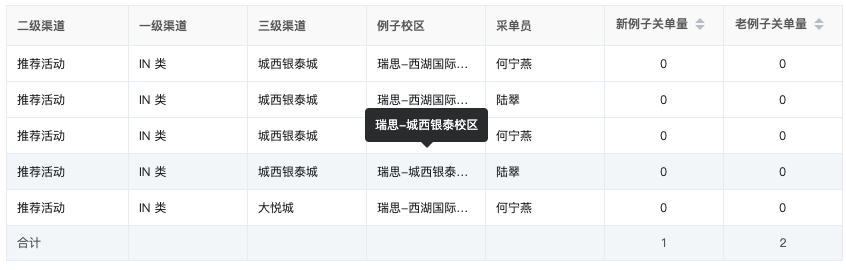

# 动态表格

## 业务场景

- 表格中的列由后台配置生成
- 列的排序也有后台定义，且由后台来排序
- 合计也由后台来计算

## 效果图



## 技术实现

- 使用elementUI 的 table
- 通过接口返回的列字段遍历匹配到每个prop

```vue
<template>
  <div id="app">
    <el-table
      class="my-table"
      :data="tableData"
      border
      :header-cell-class-name="() => 'my-table__header-th'"
      :summary-method="getSummary"
      @sort-change="sortChange"
      show-summary
    >
      <el-table-column
        v-for="col in cols"
        :key="col.prop"
        :prop="col.prop"
        :label="col.label"
        :sortable="col.sortable ? 'custom' : false"
        class-name="my-table__td"
        :align="!col.sortable ? 'left' : 'center'"
        show-overflow-tooltip
        :min-width="100"
      ></el-table-column>
    </el-table>
  </div>
</template>

<script>
const SORT = {
  ascending: 'asc',
  descending: 'desc',
}
export default {
  name: 'app',
  data() {
    return {
      tableData: [
        {
          DIM_004400: '推荐活动',
          DIM_004500: 'IN 类',
          DIM_004700: '城西银泰城',
          DIM_007400: '瑞思-西湖国际校区',
          DIM_011500: '何宁燕',
          OBJ_ODI_000109: '0',
          OBJ_ODI_000110: '0',
        },
        {
          DIM_004400: '推荐活动',
          DIM_004500: 'IN 类',
          DIM_004700: '城西银泰城',
          DIM_007400: '瑞思-西湖国际校区',
          DIM_011500: '陆翠',
          OBJ_ODI_000109: '0',
          OBJ_ODI_000110: '0',
        },
        {
          DIM_004400: '推荐活动',
          DIM_004500: 'IN 类',
          DIM_004700: '城西银泰城',
          DIM_007400: '瑞思-城西银泰校区',
          DIM_011500: '何宁燕',
          OBJ_ODI_000109: '0',
          OBJ_ODI_000110: '0',
        },
        {
          DIM_004400: '推荐活动',
          DIM_004500: 'IN 类',
          DIM_004700: '城西银泰城',
          DIM_007400: '瑞思-城西银泰校区',
          DIM_011500: '陆翠',
          OBJ_ODI_000109: '0',
          OBJ_ODI_000110: '0',
        },
        {
          DIM_004400: '推荐活动',
          DIM_004500: 'IN 类',
          DIM_004700: '大悦城',
          DIM_007400: '瑞思-西湖国际校区',
          DIM_011500: '何宁燕',
          OBJ_ODI_000109: '0',
          OBJ_ODI_000110: '0',
        },
      ],
      cols: [
        { label: '二级渠道', prop: 'DIM_004400' },
        { label: '一级渠道', prop: 'DIM_004500' },
        { label: '三级渠道', prop: 'DIM_004700' },
        { label: '例子校区', prop: 'DIM_007400' },
        { label: '采单员', prop: 'DIM_011500' },
        { label: '新例子关单量', prop: 'OBJ_ODI_000109', sortable: true },
        { label: '老例子关单量', prop: 'OBJ_ODI_000110', sortable: true },
      ],
      total: { value: '合计', OBJ_ODI_000109: 1, OBJ_ODI_000110: 2 },
    }
  },
  mounted() {},
  methods: {
    // 排序
    sortChange({ column, prop, order }) {
      console.log(SORT[order])
    },
    // 合计
    getSummary(params) {
      let { columns } = params
      let sums = []
      columns.map((column, index) => {
        if (index === 0) {
          sums[index] = this.total.value
          return
        }
        if (this.total.hasOwnProperty(column.property)) {
          sums[index] = this.total[column.property]
        } else {
          sums[index] = ''
        }
      })
      return sums
    },
  },
}
</script>

<style scoped>
/* 全局样式 */
.my-table {
  width: 100%;
  color: #262626;
  font-size: 12px;
}
/* td样式 */
.my-table /deep/ .my-table__td {
  padding: 0;
  height: 36px;
}
/* th样式 */
.my-table /deep/ .my-table__header-th {
  height: 40px;
  background: #fafafb;
  color: rgba(0, 0, 0, 0.65);
}
</style>

```

::: warning 问题
合计如果放置到顶部会与fixed定位冲突
:::