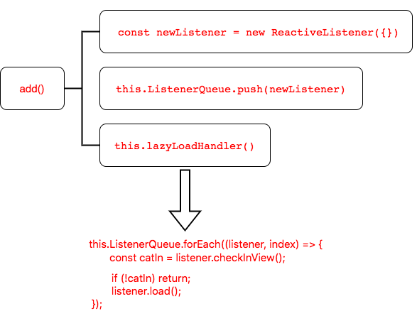

# vue-lazyload源码阅读

## 为什么要阅读vue-lazyload

在开发项目过程中，经常会遇到一个问题，当一个页面中需要加载大量的图片，如果一次性加载完，会浪费网络资源不说，而且页面加载也会很慢，用户体验非常的不好。因此，需要图片懒加载这种技术手段来处理这个问题，然而平时项目都比较赶，最快的方式就去找一个插件来使用。而我选择了[vue-lazyload](https://github.com/hilongjw/vue-lazyload)这款插件，主要原因是在github上star相对来说比较多。

为了不做一个拿来主义者，利用业余时间读下源码，给自己充充电

## 预备知识

1. 打包工具[rollupjs](https://www.rollupjs.com/)
2. [vue插件](https://cn.vuejs.org/v2/guide/plugins.html)系统

使用插件：
```js
Vue.use(MyPlugin, { someOption: true })
```

开发插件：

```js
MyPlugin.install = function (Vue, options) {
  // 1. 添加全局方法或 property
  Vue.myGlobalMethod = function () { /* 逻辑... */ }
  // 2. 添加全局指令
  Vue.directive('my-directive', {
    // 指令第一次绑定到元素时调用，做初始化设置
    bind (el, binding, vnode, oldVnode) { /* 逻辑... */ }, 
    // 被绑定元素插入父节点时调用
    inserted (el, binding, vnode, oldVnode) { /* 逻辑... */ },
    // 所在组件的 虚拟DOM 更新时调用
    update (el, binding, vnode, oldVnode) { /* 逻辑... */ },
    // 指令所在组件的 虚拟DOM 及其子 虚拟DOM 全部更新后调用
    componentUpdated (el, binding, vnode, oldVnode) { /* 逻辑... */ },
    // 指令与元素解绑时调用
    unbind (el, binding, vnode, oldVnode) { /* 逻辑... */ }
  })
  // 3. 注入组件选项
  Vue.mixin({
    created: function () { /* 逻辑... */ }
    ...
  })
  // 4. 添加实例方法
  Vue.prototype.$myMethod = function (methodOptions) { /* 逻辑... */ }
  // 5. 添加全局组件
  Vue.component('', function() {})
}
```
指令钩子函数的四个参数`el`，`binding`，`vnode`，`oldVnode`说明如下：

- el：指令所绑定的DOM元素
- binding：一个对象，包含以下属性：
    - name：指令名，不包括 `v-` 前缀。
    - value：指令的绑定值，例如`v-my-directive="1 + 1"` 中，绑定值为 `2`。
    - oldValue：指令绑定的前一个值，仅在 `update` 和 `componentUpdated` 钩子中可用
    - expression：字符串形式的指令表达式。例如 `v-my-directive="1 + 1"` 中，表达式为 `"1 + 1"`。
    - arg：传给指令的参数，可选。例如 `v-my-directive:foo` 中，参数为 `"foo`"。
    - modifiers：一个包含修饰符的对象。例如 `v-my-directive.foo.bar` 中，修饰符对象为 `{ foo: true, bar: true }`
- vnode：Vue 编译生成的虚拟节点
- oldVnode：上一个虚拟节点，仅在 update 和 componentUpdated 钩子中可用

3. [vue自定义指令](https://cn.vuejs.org/v2/guide/custom-directive.html)

注册全局指令`v-focus`：
```js
Vue.directive('focus', {
  // 当被绑定的元素插入到 DOM 中时……
  inserted: function (el) {
    // 聚焦元素
    el.focus()
  }
})
```

注册局部指令`v-focus`：
```js
directives: {
  focus: {
    // 指令的定义
    inserted: function (el) {
      el.focus()
    }
  }
}
```

指令的使用：

```vue
<input v-focus>
```

4. 全局组件注册

```js
Vue.component('my-component-name', {
  // ... 选项 ...
})
```

```js
import ComponentA from '@/components/ComponentA'
Vue.component('my-component-name', ComponentA)
```
  
5. 图片懒加载的原理
   
一句话概括：当图片出现在视口中时，再去加载图片

具体实现步骤：
- 将图片的`url`存放到`data-src`中
- 当图片出现在视口中时，再将`data-src`的值赋给`src`

如何判断图片是否出现在视口中：

- 事件监听
- [IntersectionObserver](https://developer.mozilla.org/zh-CN/docs/Web/API/IntersectionObserver)

## 如何调试vue-lazyload的源码

1. 首先到`github`上将[vue-lazyload](https://github.com/hilongjw/vue-lazyload)源码clone下来
2. 创建一个vue项目,这里我使用[vue-cli](https://cli.vuejs.org/)脚手架创建

```bash
vue create lazy

cd lazy

yarn serve
```

3. 将`vue-lazyload`源码中的`src`目录copy到自己的项目中，并`src`目录改名为`vue-lazyload`(可以自己随便定义)
4. 在`main.js`文件中引入该项目

```js
import Vue from 'vue'
import App from './App.vue'
import Lazyload from './vue-lazyload'

Vue.config.productionTip = false

Vue.use(Lazyload, { 
  preLoad: 1.3, 
  attempt: 2 ,
})

new Vue({
  render: (h) => h(App),
}).$mount('#app')

```
::: warning
由于`vue-lazyload`项目中引入插件`assign-deep`,所以我们需要手动去安装这个插件, 执行命令`yarn install assign-deep`即可
:::

5. 以上步骤完成之后，我们就可以在自己的项目随便的调试源码了，是不是so easy

## 项目目录

```bash
├── src
│   ├── index.js
│   ├── lazy-component.js
│   ├── lazy-container.js
│   ├── lazy-image.js
│   ├── lazy.js
│   ├── listener.js
│   └── util.js
```

## index

首先，我们当然是从入口文件`index.js`开始下手, 其中包含了一些`vue1.0`版本相关的兼容性代码，`vue3.0`即将在8月份来临，还有人在用`vue1.0`？因此，我们注释掉`vue1.0`相关的兼容性代码，代码也会显得更加的简单明了。

源码及逐行解析如下：
```js
import Lazy from './lazy'
import LazyComponent from './lazy-component'
import LazyContainer from './lazy-container'
import LazyImage from './lazy-image'

export default {
  // 插件提供install方法用于注册使用，传入两个参数`Vue`, `options`(自定义参数)
  install (Vue, options = {}) {
    // 执行`Lazy`函数，传入了唯一的参数`Vue`，并返回了`LazyClass`类
    const LazyClass = Lazy(Vue)
    // 实例化`LazyClass`类，传入自定义参数`options`, 得到实例`lazy`,图片懒加载的重要逻辑都在这个类中实现
    const lazy = new LazyClass(options)
    
    // 实例化`LazyContainer`得到实例`lazyContainer`,传入实例`{ lazy }`
    const lazyContainer = new LazyContainer({ lazy })

    // 将实例`lazy`挂载到`Vue`的原型属性`$Lazyload`上
    Vue.prototype.$Lazyload = lazy

    // 注册全局组件
    if (options.lazyComponent) {
      // 注册全局组件`lazy-component`
      // 执行 LazyComponent() 传入 `lazy`实例，返回一个对象
      Vue.component('lazy-component', LazyComponent(lazy))
    }
    if (options.lazyImage) {
      // 注册全局组件`lazy-image`
      // 执行 LazyImage() 传入 `lazy`实例，返回一个对象
      Vue.component('lazy-image', LazyImage(lazy))
    }

    // 注册全局
    // 注册全局指令`lazy`
    Vue.directive('lazy', {
      // 指令第一次绑定到元素时，执行 lazy.add
      bind: lazy.add.bind(lazy),
      // 所在组件的 虚拟dom更新时，执行初始化，执行 lazy.update
      update: lazy.update.bind(lazy),
      // 指令所在的虚拟dom及其子虚拟dom全部更新后，执行 lazy.lazyLoadHandler
      componentUpdated: lazy.lazyLoadHandler.bind(lazy), 
      // 指令与元素解绑时, 执行 lazy.remove
      unbind: lazy.remove.bind(lazy) 
    })

    // 注册全局指令`lazy-container`
    Vue.directive('lazy-container', {
      // 指令第一次绑定到元素时，执行 lazyContainer.bind
      bind: lazyContainer.bind.bind(lazyContainer),
      // 指令所在的虚拟dom及其子虚拟dom全部更新后，执行 lazyContainer.update
      componentUpdated: lazyContainer.update.bind(lazyContainer),
      // 指令与元素解绑时, 执行 lazyContainer.unbind
      unbind: lazyContainer.unbind.bind(lazyContainer)
    })
  }
}
```

由上面的分析，可以看出来，入口文件做了如下几件事：

- 提供了注册插件的入口`install`
- 注册 `lazy-component`, `lazy-image` 全局组件
- 注册 `v-lazy`, `v-lazy-container` 全局指令

使用如下的方式来使用自定义指令：

注册插件：
```js
import VueLazyload from 'vue-lazyload'

Vue.use(Lazyload, { /* 自定义参数 */ })
```

使用指令：
```vue

```

当我们使用`v-lazy`指令的时候，首先会触发定义的钩子函数`bind`，也就是`lazy.add`方法，而这个方法是定义在`Lazy`类当中的，因此接下来，我们来分析下`Lazy`类的实现

## lazy

当指令第一次绑定到元素时，会调用`lazy.add`的方法，先看下`add`方法的大致实现方式：



可以看出，插件内部维护了一个监听队列`ListenerQueue`，来存储图片，通过遍历这个监听队列，最终实现图片的懒加载

为了有一个全局观，我们先看下代码结构，再去具体分析：

```js
import { /* 一系列的工具方法 */} from "./util";
import ReactiveListener from "./listener";
export default function(Vue) {
  return class Lazy {
    constructor({preLoad, error,throttleWait,/* ...还有很多传入的参数 */}) {
      this.ListenerQueue = [];
      this.TargetIndex = 0;
      this.TargetQueue = [];
      this.options = {
        silent: silent, 
        dispatchEvent: !!dispatchEvent,
        throttleWait: throttleWait || 200, 
        // ...还有很多的属性
      };
      this._initEvent();
      this._imageCache = new ImageCache({ max: 200 });
      this.lazyLoadHandler = throttle(
        this._lazyLoadHandler.bind(this),
        this.options.throttleWait
      );
      this.setMode(this.options.observer ? modeType.observer : modeType.event);
    }
    addLazyBox(vm) {}
    add(el, binding, vnode) {}
    update(el, binding, vnode) {}
    remove(el) {}
    removeComponent() {}
    setMode(mode) {}
    _addListenerTarget(el) {}
    _removeListenerTarget(el) {}
    _initListen(el, start) {}
    _initEvent() {}
    _lazyLoadHandler() {}
    _initIntersectionObserver() {}
    _observerHandler(entries, observer) {}
    _elRenderer(listener, state, cache) {}
    _valueFormatter(value) {}
  }
}

```

`adds()`的实现：

```js
add(el, binding, vnode) {
  // 如果已存在则更新
  if (some(this.ListenerQueue, (item) => item.el === el)) {
    this.update(el, binding);
    return Vue.nextTick(this.lazyLoadHandler);
  }
  // 根据binding.value，获取图片的真是src, loading, error
  // cors获取不到，因为_valueFormatter没有返回cors
  let { src, loading, error, cors } = this._valueFormatter(binding.value);

  // 由于这个时候DOM还没有渲染完成，需要做一些dom的操作，必须在nextTick中完成
  Vue.nextTick(() => {
    //  如果el不是img标签 或者 该dom不包含属性data-srcset使用src
    src = getBestSelectionFromSrcset(el, this.options.scale) || src;

    // 使用交叉观察者模式观察dom元素
    this._observer && this._observer.observe(el);

    // 获取修饰符
    const container = Object.keys(binding.modifiers)[0];

    // 定义父级dom元素
    let $parent;
    // 如果修饰符存在 ???
    if (container) {
      $parent = vnode.context.$refs[container];
      // if there is container passed in, try ref first, then fallback to getElementById to support the original usage
      $parent = $parent
        ? $parent.$el || $parent
        : document.getElementById(container);
    }

    if (!$parent) {
      // 返回window对象
      $parent = scrollParent(el);
    }

    const newListener = new ReactiveListener({
      // bindType，传给指令的参数,例如 v-lazy:background-image="imgUrl" 中，参数为 "background-image"
      // 目前就是css的background-image属性
      bindType: binding.arg, 
      $parent, // 父级dom元素
      el, // 当前dom元素
      loading, // 图片loading地址
      error, // 图片error地址
      src, // 图片真实src地址
      cors, // 这是获取不到的
      elRenderer: this._elRenderer.bind(this), // 实例化ReactiveListener的时候会执行，传入参数 "loading", false
      options: this.options, // 参数
      imageCache: this._imageCache, // 图片缓存实例
    });

    // ListenerQueue 添加 listener
    this.ListenerQueue.push(newListener);

    if (inBrowser) {
      // TargetQueue 添加 target，
      // 为DOM元素（el）遍历监听事件，添加事件监听，el分别设置为：window，$parent
      this._addListenerTarget(window);
      this._addListenerTarget($parent);
    }
    // 执行懒加载
    this.lazyLoadHandler();
    // 有无必要在嵌套一个异步更新DOM???
    // Vue.nextTick(() => this.lazyLoadHandler());
  });
}
```

## listener

主要是维护`ReactiveListener`类

## util

## lazy-component

## lazy-container

## lazy-image