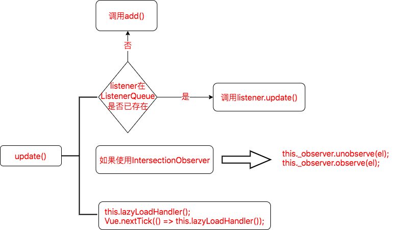
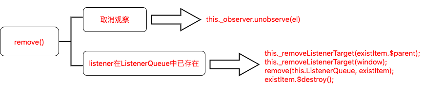
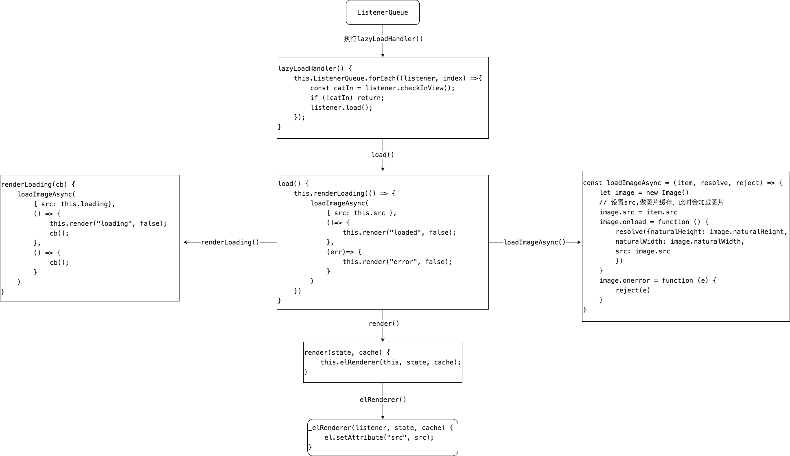

# vue-lazyload源码阅读

## 为什么要读源码

1. 项目中使用过，但是不是很明白它是怎么实现的

在开发项目过程中，经常会遇到一个问题，当一个页面中需要加载大量的图片，如果一次性加载完，会浪费网络资源不说，而且页面加载也会出现卡顿，用户体验非常的不好。因此，需要图片懒加载这种技术手段来处理这个问题，然而平时项目都比较赶，最快的方式就去找一个插件来使用。而我选择了[vue-lazyload](https://github.com/hilongjw/vue-lazyload)这款插件，主要原因是在github上star相对来说比较多。

2. 为了不做一个拿来主义者，利用业余时间读下源码，给自己充充电

## 准备工作

### 1.Rollupjs

[Rollupjs](https://www.rollupjs.com/)是 JavaScript 模块打包器，配置非常的简单，`Vue`源代码也是使用`Rollupjs`打包的，非常有必要玩一下

### 2.Vue插件

自定义插件：

```js
MyPlugin.install = function (Vue, options) {
  // 1. 添加全局方法或 property
  Vue.myGlobalMethod = function () { /* 逻辑... */ }
  // 2. 添加全局指令（这里重点关注）
  Vue.directive('my-directive', {
    // 指令第一次绑定到元素时调用，做初始化设置（只调用一次）
    bind (el, binding, vnode, oldVnode) { /* 逻辑... */ }, 
    // 被绑定元素插入父节点时调用
    inserted (el, binding, vnode, oldVnode) { /* 逻辑... */ },
    // 所在组件的 虚拟DOM 更新时调用(虚拟DOM更新前，生命周期为beforeUpdate())
    update (el, binding, vnode, oldVnode) { /* 逻辑... */ },
    // 指令所在组件的 虚拟DOM 及其子 虚拟DOM 全部更新后调用（虚拟DOM更新前后,生命周期为updated()）
    componentUpdated (el, binding, vnode, oldVnode) { /* 逻辑... */ },
    // 指令与元素解绑时调用（当前组件销毁 或者 指令绑定的元素存在v-if为false）（只调用一次）
    unbind (el, binding, vnode, oldVnode) { /* 逻辑... */ }
  })
  // 3. 注入组件选项
  Vue.mixin({
    created: function () { /* 逻辑... */ }
    ...
  })
  // 4. 添加实例方法
  Vue.prototype.$myMethod = function (methodOptions) { /* 逻辑... */ }
  // 5. 添加全局组件（这里重点关注）
  Vue.component('', function() {})
}
```

::: details 指令钩子函数的参数
指令钩子函数的四个参数`el`，`binding`，`vnode`，`oldVnode`说明如下：

- el：指令所绑定的DOM元素
- binding：一个对象，包含以下属性：
    - name：指令名，不包括 `v-` 前缀。
    - value：指令的绑定值，例如`v-my-directive="1 + 1"` 中，绑定值为 `2`。
    - oldValue：指令绑定的前一个值，仅在 `update` 和 `componentUpdated` 钩子中可用
    - expression：字符串形式的指令表达式。例如 `v-my-directive="1 + 1"` 中，表达式为 `"1 + 1"`。
    - arg：传给指令的参数，可选。例如 `v-my-directive:foo` 中，参数为 `"foo`"。
    - modifiers：一个包含修饰符的对象。例如 `v-my-directive.foo.bar` 中，修饰符对象为 `{ foo: true, bar: true }`
- vnode：Vue 编译生成的虚拟节点
- oldVnode：上一个虚拟节点，仅在 update 和 componentUpdated 钩子中可用
:::
  
注册自定义插件并传入参数：
```js
Vue.use(MyPlugin, { someOption: true })
```

::: tip 提示
官方文档入口[Vue插件系统](https://cn.vuejs.org/v2/guide/plugins.html)
:::

### 3.Vue指令

注册全局指令`v-focus`：
```js
Vue.directive('focus', {
  // 当被绑定的元素插入到 DOM 中时……
  inserted: function (el) {
    // 聚焦元素
    el.focus()
  }
})
```

注册局部指令`v-focus`：
```js
directives: {
  focus: {
    // 指令的定义
    inserted: function (el) {
      el.focus()
    }
  }
}
```

使用指令：

```vue
<input v-focus>
```

::: tip 提示
以上官方提供的demo，具体可查询官方文档[Vue自定义指令](https://cn.vuejs.org/v2/guide/custom-directive.html)
:::

### 4.全局组件

注册全局组件：

函数组件形式：
```js
Vue.component('component-name', {
  props: []
  data: function() {
    return {}
  },
  methods: {},
  template: ''
  // options
})
```
以`.vue`模板的形式：
```js
import ComponentA from '@/components/ComponentA'
Vue.component('component-name', ComponentA)
```
  
### 5.图片懒加载的原理
   
懒加载的应用场景：当图片出现在视口中时，再加载图片

实现步骤：
1. 先将图片的`url`存放到`data-src`自定义属性（可随便设置）中（通过`el.dataset.src`来获取该属性的值）
2. 实例化`Image`对象得到缓存对象`cacheImg`
3. 判断图片是否出现在视口中`checkInView`
4. 如果图片出现在视口中，将图片的`data-src`赋值给`cacheImg`的`src`，加载图片
5. 通过事件`onload`，判断图片加载成功，如果是，则将`cacheImg`的`src`赋值给图片的`src`
6. 通过事件`onerror`，判断图片失败，这时，将`error`图片的url赋值给图片的`src`

简单实现：

```js
preloadImg() {
  // 获取img dom的集合 imgList
  const imgList = document.querySelectorAll('img')
  // 遍历 imgList
  imgList.forEach(el => {
    // 实例化Image对象
    let cacheImg = new Image()
    // 检查图片是否出现在视口中
    if (checkInView(el)){
      // 将 data-src 中的值赋值给 cacheImg 的 src，此时会加载图片
      cacheImg.src = el.dataset.src
      // 图片加载完成
      cacheImg.onload = () => {
        // 将 img.src 设置给对应的 el src
        el.setAttribute("src", cacheImg.src);
      }
      // 图片加载失败
      img.onerror = () => {
        // 设置 error 图片
        el.setAttribute("src", './error.jpg');
      }
    }
  })
}
```

如何判断图片是否出现在视口中：

- 第一种方式：通过监听`scroll`等事件，调用目标元素的[getBoundingClientRect()](https://developer.mozilla.org/en-US/docs/Web/API/Element/getBoundingClientRect)方法，得到它相对于视口的坐标，即可判断是否出现在视口中

getBoundingClientRect的图解：


实现：

```js
checkInView() {
  const rect = el.getBoundingClientRect() // 获取当前dom元素的大小及其相对于视口的位置
  const height = window.innerHeight // 视口高度
  const width = window.innerWidth  // 视口宽度
  const yInView = rect.top < height && rect.bottom > 0 // 纵向出现在视口中
  const xInView = rect.left < width && rect.right > 0 // 横向出现在视口中
  return yInView && xInView
},
```

- 第二种方式：浏览器自带的 交叉观察器 [IntersectionObserver](https://developer.mozilla.org/en-US/docs/Web/API/Intersection_Observer_API) api

简单实现：

```js
createObserver() {
  // 1. 定义参数
  const options = {
    root: null, // 视口,默认是 null,即document对象
    rootMargin: '0px', // 围绕视口的边距
    threshold: 0, // 阈值，数组或者数字，表示在目标元素在视口中出现的百分比是多少时，再去触发回调函数
  }
  /**
    * 2. 定义会调用回调函数，目标元素与视口相交时会调用该回调函数
    * @param {*} entries IntersectionObserverEntry的集合
    * @param {*} observer IntersectionObserver的实例
    */
  const callback = (entries, observer) => {
    // console.log(entries, 'entries')
    entries.forEach((entry) => {
      // 调用observe方法的时，会触发一次回调函数，因此需要判断是否交叉
      if (entry.isIntersecting) {
        // entry.target 被观察的DOM元素
        // observe === observer
        // observe.unobserve(document.getElementById('element'))
      }
    })
    // console.log(observe === observer)
  }
  /**
    * 3. 创建观察器实例，异步观察目标元素与视口相交的变化
    * @param {*} callback 目标元素的可见性变化时,调用的回调函数
    * @param {*} options 参数
    */
  const observe = new IntersectionObserver(callback, options)

  // 4. 指定 DOM节点 开始观察
  observe.observe(document.getElementById('element'))
  // 取消指定 DOM节点 的观察
  // observe.unobserve(document.getElementById('element'))
},
```

## 如何调试源码

1. 首先从`github`上将[vue-lazyload](https://github.com/hilongjw/vue-lazyload)源码`clone`下来
2. 创建一个`Vue`项目,这里我使用[Vue CLI](https://cli.vuejs.org/)脚手架创建

```bash
vue create lazy
cd lazy
yarn serve
```

3. 将`vue-lazyload`源码中的`src`目录copy到上面创建的项目中，并`src`目录改名为`vue-lazyload`(可以自己随便定义)
4. 在`main.js`文件引入，并注册插件

```js
import Vue from 'vue'
import App from './App.vue'
import Lazyload from './vue-lazyload'
Vue.config.productionTip = false
Vue.use(Lazyload)
new Vue({
  render: (h) => h(App),
}).$mount('#app')

```
::: warning 警告
由于`vue-lazyload`项目中引入插件`assign-deep`,所以需要先手动安装下这个插件, 执行命令`yarn install assign-deep`即可
:::

5. 以上步骤完成之后，就可以启动自己的项目，随便的调试源码了

至此，准备工作已经完全做完，下面正式开始解读源码！

## 目录结构

```bash
├── src
│   ├── index.js
│   ├── lazy-component.js
│   ├── lazy-container.js
│   ├── lazy-image.js
│   ├── lazy.js
│   ├── listener.js
│   └── util.js
```

目录解读：

- index.js：入口文件
- lazy-component.js：懒加载组件
- lazy-container.js：懒加载容器
- lazy-image.js：官方文档中尚未列出参数`lazyImage`,暂不分析
- lazy.js：懒加载类
- listener.js：监听类
- util.js：工具函数

<!-- ## 概要

`vue-lazyload`是通过将每张图片组装成一个`listener`，然后存放到`ListenerQueue`中，通过遍历这个队列，监听判断图片是否出现在视口中，再执行懒加载。它判断图片是否出现在视口中有两种方式，一种是通过监听事件，判断图片是否出现在视口中，如果是则执行懒加载，另外一种是通过交叉监听来判断图片是否出现在视口中，如果是则执行懒加载。 -->

## 入口文件index

首先从入口文件`index.js`开始下手, 其中包含了一些`vue1.0`版本相关的兼容性代码，`vue3.0`即将在8月份来临，还有人在用`vue1.0`？因此，注释掉`vue1.0`相关的兼容性代码，代码结构也会显得更加的简单明了。

源码解析如下：
```js
import Lazy from './lazy'
import LazyComponent from './lazy-component'
import LazyContainer from './lazy-container'

export default {
  // 插件提供install方法用于注册，传入两个参数，分别为`Vue`, `options`(自定义参数)
  install (Vue, options = {}) {
    // 执行`Lazy`函数，传入参数`Vue`，返回`LazyClass`类
    const LazyClass = Lazy(Vue)
    // 实例化`LazyClass`类，传入自定义参数`options`, 得到实例`lazy`
    const lazy = new LazyClass(options)
    
    // 实例化`LazyContainer`，并传入实例`{ lazy }`，得到实例`lazyContainer`
    const lazyContainer = new LazyContainer({ lazy })

    // 将实例`lazy`挂载到`Vue`的原型属性`$Lazyload`上
    Vue.prototype.$Lazyload = lazy

    // 注册组件
    if (options.lazyComponent) {
      // 执行 LazyComponent()，传入 `lazy`实例，返回一个Vue组件
      Vue.component('lazy-component', LazyComponent(lazy))
    }

    // 注册全局指令`v-lazy`
    Vue.directive('lazy', {
      // 指令第一次绑定到元素时，执行 lazy.add()
      bind: lazy.add.bind(lazy),
      // 所在组件的 虚拟DOM 更新时，执行初始化，执行 lazy.update()
      update: lazy.update.bind(lazy),
      // 指令所在的 虚拟DOM 及 其子虚拟DOM 全部更新后，执行 lazy.lazyLoadHandler()
      componentUpdated: lazy.lazyLoadHandler.bind(lazy), 
      // 指令与元素解绑时, 执行 lazy.remove()
      unbind: lazy.remove.bind(lazy) 
    })

    // 注册全局指令`v-lazy-container`
    Vue.directive('lazy-container', {
      bind: lazyContainer.bind.bind(lazyContainer), // lazyContainer.bind()
      componentUpdated: lazyContainer.update.bind(lazyContainer),// lazyContainer.update
      unbind: lazyContainer.unbind.bind(lazyContainer) // lazyContainer.unbind
    })
  }
}
```

从上面的分析，可以看出来，入口文件做了如下几件事：

- 提供了注册插件的入口`install`
- 在注册插件的同时，注册了 `lazy-component`全局组件
- 在注册插件的同时，注册了 `v-lazy`, `v-lazy-container` 全局指令

::: warning

1. 以上定义的钩子函数都带有一个`bind`，是为了使得函数中的`this`指向`Lazy`类或`LazyContainerMananger`类，若不绑定 `this` 会指向 `undefined`
2. 不可以使用`call`或者`apply`，因为会立即执相应的函数
:::

当我们使用`v-lazy`指令的时候，也就是指令`v-lazy`第一次绑定到元素时，会触发`bind`钩子函数，也就是`lazy.add()`方法，而这个方法是定义在`Lazy`类当中的，因此接下来，分析下`Lazy`类的实现

## Lazy类

功能：懒加载的主要功能都在这个类中实现

由于`lazy.js`文件中的代码较多，为了有一个全局观，先看下`Lazy`类的大致结构,如下所示为简化后的代码：

```js
import { /* 一系列的工具方法，下面会介绍到 */} from "./util";
// 监听器，这个是vue-lazyload的核心，后面在去理解
import ReactiveListener from "./listener";

export default function(Vue) {
  return class Lazy {
    constructor({preLoad, error,throttleWait,/* ...插件支持的用户入参 */}) {
      this.ListenerQueue = []; // 监听队列，用来存放监听器
      this.TargetIndex = 0;
      this.TargetQueue = [];
      this.options = {
        silent: silent, 
        dispatchEvent: !!dispatchEvent,
        throttleWait: throttleWait || 200, 
        // ...还有很多的参数属性
      };
      this._initEvent();
      this._imageCache = new ImageCache({ max: 200 });
      this.lazyLoadHandler = throttle(
        this._lazyLoadHandler.bind(this),
        this.options.throttleWait
      );
      this.setMode(this.options.observer ? modeType.observer : modeType.event);
    }
    addLazyBox(vm) {}
    add(el, binding, vnode) {} // *****bind钩子函数
    update(el, binding, vnode) {} // *****update钩子函数
    remove(el) {} // *****unbind钩子函数
    removeComponent() {}
    setMode(mode) {}
    _addListenerTarget(el) {}
    _removeListenerTarget(el) {}
    _initListen(el, start) {}
    _initEvent() {}
    _lazyLoadHandler() {} // *****componentUpdated钩子函数
    _initIntersectionObserver() {}
    _observerHandler(entries, observer) {}
    _elRenderer(listener, state, cache) {}
    _valueFormatter(value) {}
  }
}

```

`add()`方法实现的大致流程：


可以看出，插件内部维护了一个监听队列`ListenerQueue`，来存储监听器 `listener`对象，通过遍历监听队列`ListenerQueue`，最终实现每张图片的懒加载

`add()`方法的源码：

```js
add(el, binding, vnode) {
  // 通过 DOM元素 判断监听器是否已存在于监听队列中
  if (some(this.ListenerQueue, (item) => item.el === el)) {
    // 如果已存在，则调用更新方法 update
    this.update(el, binding);
    // 在下一次DOM更新循环之后，执行lazyLoadHandler
    return Vue.nextTick(this.lazyLoadHandler);
  }
  // 根据binding.value，获取图片的真实src, loading, error
  // cors获取不到，因为_valueFormatter没有返回cors
  let { src, loading, error, cors } = this._valueFormatter(binding.value);

  // 由于这个时候DOM还没有渲染完成，需要做一些dom的操作，必须在nextTick中完成
  Vue.nextTick(() => {
    //  如果el不是img标签 或者 该dom不包含属性data-srcset使用src
    src = getBestSelectionFromSrcset(el, this.options.scale) || src;

    // 使用交叉观察者模式观察dom元素
    this._observer && this._observer.observe(el);

    // 获取修饰符
    const container = Object.keys(binding.modifiers)[0];

    // 定义父级dom元素
    let $parent;
    // 如果修饰符存在 ???
    if (container) {
      $parent = vnode.context.$refs[container];
      // if there is container passed in, try ref first, then fallback to getElementById to support the original usage
      $parent = $parent
        ? $parent.$el || $parent
        : document.getElementById(container);
    }

    if (!$parent) {
      // 返回window对象
      $parent = scrollParent(el);
    }

    const newListener = new ReactiveListener({
      // bindType，传给指令的参数,例如 v-lazy:background-image="imgUrl" 中，参数为 "background-image"
      // 目前就是css的background-image属性
      bindType: binding.arg, 
      $parent, // 父级dom元素
      el, // 当前dom元素
      loading, // 图片loading地址
      error, // 图片error地址
      src, // 图片真实src地址
      cors, // 这是获取不到的
      elRenderer: this._elRenderer.bind(this), // 实例化ReactiveListener的时候会执行，传入参数 "loading", false
      options: this.options, // 参数
      imageCache: this._imageCache, // 图片缓存实例
    });

    // ListenerQueue 添加 listener
    this.ListenerQueue.push(newListener);

    if (inBrowser) {
      // TargetQueue 添加 target，
      // 为DOM元素（el）遍历监听事件，添加事件监听，el分别设置为：window，$parent
      this._addListenerTarget(window);
      this._addListenerTarget($parent);
    }
    // 执行懒加载
    this.lazyLoadHandler();
    // 有无必要在嵌套一个异步更新DOM???
    Vue.nextTick(() => this.lazyLoadHandler());
  });
}
```

::: warning 疑问
有必要在`Vue.nextTick`中再次去调用一次`Vue.nextTick(() => this.lazyLoadHandler());`？？？
:::

当虚拟dom更新时，会调用`lazy.update`方法，`update()`方法的实现的大致流程：



`update()`的实现源码如下：
```js
update(el, binding, vnode) {
  let { src, loading, error } = this._valueFormatter(binding.value);
  src = getBestSelectionFromSrcset(el, this.options.scale) || src;

  // 查询监听队列中图片监听器是否已存在
  const exist = find(this.ListenerQueue, (item) => item.el === el);
  if (!exist) {
    // 如果不存在则调用 add方法
    this.add(el, binding, vnode);
  } else {
    // 如果已存在，则调用图片监听器的update方法，替换图片的src
    exist.update({
      src,
      loading,
      error,
    });
  }
  // 如果是使用 IntersectionObserver api，则先取消观察，在重新观察
  if (this._observer) {
    this._observer.unobserve(el);
    this._observer.observe(el);
  }
  this.lazyLoadHandler();
  Vue.nextTick(() => this.lazyLoadHandler());
}
```

::: warning 疑问
在指令钩子函数`componentUpdated`已经调用了一次`lazyLoadHandler`，是否有必要再次调用一次`Vue.nextTick(() => this.lazyLoadHandler());`？？？
:::

当指令与元素解绑时，调用`lazy.remove`方法，`remove()`方法的大致实现流程图：



`remove()`的源码：

```js
remove(el) {
  if (!el) return;
  this._observer && this._observer.unobserve(el);
  const existItem = find(this.ListenerQueue, (item) => item.el === el);
  // 如果存在
  if (existItem) {
    // 为什么要执行两次，因为add()方法中_addListenerTarget执行了两次，分别传入window，$parent
    // 删除 TargetQueue 中指定的el
    this._removeListenerTarget(existItem.$parent);
    // 删除 TargetQueue 中指定的el
    this._removeListenerTarget(window);
    // 删除 ListenerQueue 中指定的 listener
    remove(this.ListenerQueue, existItem);
    // 初始化这部分数据
    existItem.$destroy();
  }
}
```

## ReactiveListener类

主要是维护`ReactiveListener`类

```js
import { loadImageAsync, ObjectKeys, noop } from "./util";

export default class ReactiveListener {
  constructor({
    el, // 当前dom元素
    src, // 图片的真实url
    error, // 图片加载错误的url
    loading, // 图片加载中的url
    bindType, // css属性
    $parent, // 父元素
    options, // 参数
    cors, // 跨域
    elRenderer, // dom元素渲染
    imageCache, // 图片缓存
  }) {
    this.el = el; // 当前dom元素
    this.src = src; // 图片的真实 url
    this.error = error; // 图片加载错误的 url
    this.loading = loading; // 图片加载中的 url
    this.bindType = bindType; // css属性
    this.attempt = 0; // 尝试加载次数
    this.cors = cors; // 跨域

    this.naturalHeight = 0; // 真实高度
    this.naturalWidth = 0; // 真实宽度

    this.options = options; // 参数

    this.rect = null; // getBoundingClientRect 对象

    this.$parent = $parent; // 父元素
    this.elRenderer = elRenderer; // dom元素渲染
    this._imageCache = imageCache; // 图片缓存

    // 性能
    this.performanceData = {
      init: Date.now(),
      loadStart: 0,
      loadEnd: 0,
    };

    // 通过自定义方法，动态修改图片的src
    this.filter();
    // 初始化状态
    // 将图片的url设置到data-src，初始化state的loading，error，loaded，rendered都为false
    this.initState();
    // 初始化渲染，传入图片加载状态loading，缓存状态false
    this.render("loading", false);
  }

  /*
   * 初始化状态
   * init listener state
   * 作用：
   * 1. 将图片的url设置到自定义的 data-src 属性上
   * 2. 初始化 this.state 对象，loading，error，loaded，rendered
   */
  initState() {
    // 设置 data-src
    // 处理dataset的兼容性问题，https://developer.mozilla.org/zh-CN/docs/Web/API/HTMLElement/dataset
    if ("dataset" in this.el) {// 通过in方法，判断 dataset属性 是否 存在与DOM对象上
      // 通过 dataset 设置自定义属性 data-src
      this.el.dataset.src = this.src;
    } else {
      // 通过 setAttribute 设置自定义属性 data-src
      this.el.setAttribute("data-src", this.src);
    }

    // 初始化状态
    this.state = {
      loading: false,
      error: false,
      loaded: false,
      rendered: false,
    };
  }

  /*
   * 记录执行时间
   * record performance
   * @return
   */
  record(event) {
    this.performanceData[event] = Date.now();
  }

  /*
   * 如果老的图片url 不等于 新的url，则，初始化initState，src为新的url
   * update image listener data
   * @param  {String} image uri
   * @param  {String} loading image uri
   * @param  {String} error image uri
   * @return
   */
  update({ src, loading, error }) {
    const oldSrc = this.src;
    this.src = src;
    this.loading = loading;
    this.error = error;
    // 通过自定义方法，动态修改图片的src
    this.filter();
    if (oldSrc !== this.src) {
      this.attempt = 0;
      this.initState();
    }
  }

  /*
   * get el node rect
   * @return
   */
  getRect() {
    // https://developer.mozilla.org/zh-CN/docs/Web/API/Element/getBoundingClientRect
    this.rect = this.el.getBoundingClientRect();
  }

  /*
   * 当前元素是否出现在视口中, true-是，false-否
   *  check el is in view
   * @return {Boolean} el is in view
   */
  checkInView() {
    this.getRect();
    return (
      this.rect.top < window.innerHeight * this.options.preLoad &&
      this.rect.bottom > this.options.preLoadTop &&
      this.rect.left < window.innerWidth * this.options.preLoad &&
        this.rect.right > 0
    );
  }

  /*
   * 通过自定义方法，动态修改图片的src
   * listener filter
   */
  filter() {
    ObjectKeys(this.options.filter).map((key) => {
      // 执行过滤函数
      this.options.filter[key](this, this.options);
    });
  }

  /*
   * 渲染loading
   * render loading first
   * @params cb:Function
   * @return
   */
  renderLoading(cb) {
    // 图片的loading状态更改为true
    this.state.loading = true;

    // 异步渲染图片
    loadImageAsync(
      {
        src: this.loading,
        cors: this.cors,
      },
      (data) => {
        this.render("loading", false);
        // 图片的loading状态更改为false
        this.state.loading = false;
        cb();
      },
      () => {
        // handler `loading image` load failed
        cb();
        // 图片的loading状态更改为false
        this.state.loading = false;
        if (!this.options.silent)
          console.warn(
            `VueLazyload log: load failed with loading image(${this.loading})`
          );
      }
    );
  }

  /*
   * 加载图片，并渲染出来
   * try load image and  render it
   * @return
   */
  load(onFinish = noop) {
    // 尝试加载次数大于自定义的尝试加载次数，并his.state.error
    if (this.attempt > this.options.attempt - 1 && this.state.error) {
      if (!this.options.silent)
        console.log(
          `VueLazyload log: ${this.src} tried too more than ${this.options.attempt} times`
        );
      onFinish();
      return;
    }

    // 图片已加载并渲染
    if (this.state.rendered && this.state.loaded) return;

    // 图片已缓存
    if (this._imageCache.has(this.src)) {
      this.state.loaded = true; // 加载图片
      this.render("loaded", true);
      this.state.rendered = true; // 渲染图片
      return onFinish();
    }

    // 渲染加载中的状态
    this.renderLoading(() => {
      this.attempt++;

      // 在图片beforeLoad阶段做自定义的事情
      this.options.adapter["beforeLoad"] &&
        this.options.adapter["beforeLoad"](this, this.options);

      // 性能测试-loadStart
      this.record("loadStart");

      loadImageAsync(
        {
          src: this.src,
          cors: this.cors,
        },
        (data) => {
          this.naturalHeight = data.naturalHeight;
          this.naturalWidth = data.naturalWidth;
          this.state.loaded = true; // 图片的loaded状态更改为true
          this.state.error = false; // 图片的error状态更改为false
          this.record("loadEnd"); // 性能测试-loadEnd
          this.render("loaded", false);
          this.state.rendered = true; // 图片的rendered状态更改为true
          this._imageCache.add(this.src); // 将图片url缓存
          onFinish();
        },
        (err) => {
          // 图片加载出错
          !this.options.silent && console.error(err);
          this.state.error = true; // 图片的error状态更改为true
          this.state.loaded = false; // 图片的loaded状态更改为false
          this.render("error", false);
        }
      );
    });
  }

  /*
   * 渲染图片
   * render image
   * @param  {String} state to render // ['loading', 'src', 'error']
   * @param  {String} is form cache
   * @return
   */
  render(state, cache) {
    this.elRenderer(this, state, cache);
  }

  /*
   * 性能测试
   * output performance data
   * @return {Object} performance data
   */
  performance() {
    let state = "loading";
    let time = 0;

    if (this.state.loaded) {
      state = "loaded";
      time =
        (this.performanceData.loadEnd - this.performanceData.loadStart) / 1000;
    }

    if (this.state.error) state = "error";

    return {
      src: this.src,
      state,
      time,
    };
  }

  /*
   * 销毁
   * $destroy
   * @return
   */
  $destroy() {
    this.el = null;
    this.src = null;
    this.error = null;
    this.loading = null;
    this.bindType = null;
    this.attempt = 0;
  }
}
```

## LazyContainer类

全局指令`v-lazy-container`，定义：

```js
Vue.directive('lazy-container', {
  bind: lazyContainer.bind.bind(lazyContainer),
  componentUpdated: lazyContainer.update.bind(lazyContainer),
  unbind: lazyContainer.unbind.bind(lazyContainer)
})
```

功能：当图片出现在视口中时，再去加载图片

使用的方式：

```vue
<div v-lazy-container="{ selector: 'img', error: 'xxx.jpg', loading: 'xxx.jpg' }">
  
  
    
</div>

或者

<div v-lazy-container="{ selector: 'img' }">
  
  
    
</div>
```

`lazy-container.js`源码：

```js
import {
  find,
  remove,
  assign,
  ArrayFrom
} from './util'

// 定义一个 LazyContainerMananger类
export default class LazyContainerMananger {
  // 接受实例化之后的lazy类
  constructor ({ lazy }) {
    this.lazy = lazy
    lazy.lazyContainerMananger = this
    // 定义队列
    this._queue = []
  }
  // 指令第一绑定时
  bind (el, binding, vnode) {
    // 实例化 LazyContainer
    const container = new LazyContainer({ el, binding, vnode, lazy: this.lazy })
    // 将实例化之后的LazyContainer存储到队列_queue中
    this._queue.push(container)
  }

  // 虚拟dom更新时，查询到队列 _queue 中需要更新的 container，调用update方法
  update (el, binding, vnode) {
    const container = find(this._queue, item => item.el === el)
    if (!container) return
    container.update({ el, binding, vnode })
  }

  // 查询队列中需要解绑的 container，调用clear方法，然后在将该container从队列中移除
  unbind (el, binding, vnode) {
    const container = find(this._queue, item => item.el === el)
    if (!container) return
    container.clear()
    remove(this._queue, container)
  }
}

// 默认选择img标签
const defaultOptions = {
  selector: 'img'
}
// 定义 LazyContainer类
class LazyContainer {
  constructor ({ el, binding, vnode, lazy }) {
    this.el = null // 默认 el为 null
    this.vnode = vnode // 获取指令钩子函数的参数 虚拟DOM
    this.binding = binding // 获取指令钩子函数的参数 binding
    this.options = {} // 定义参数
    this.lazy = lazy // 获取实例化的lazy类

    this._queue = [] // 定义队列
    this.update({ el, binding }) // 更新
  }

  update ({ el, binding }) {
    this.el = el
    // 合并参数 defaultOptions，binding.value 
    this.options = assign({}, defaultOptions, binding.value)

    // 获取img DOM对象的集合
    const imgs = this.getImgs()
    // 遍历imgDOM对象的集合
    imgs.forEach(el => {
      // 调用lazy类的add()方法，传入参数el、合并 this.binding与自定义的value、虚拟DOM
      this.lazy.add(el, assign({}, this.binding, {
        value: {
          // 需要设置 data-src为 img的url
          src: 'dataset' in el ? el.dataset.src : el.getAttribute('data-src'),
          // 使用data-error属性为每个元素设置error图片，获取使用全局的 error 参数
          error: ('dataset' in el ? el.dataset.error : el.getAttribute('data-error')) || this.options.error,
          // 使用data-loading属性为每个元素设置loading图片，获取使用全局的 loading 参数
          loading: ('dataset' in el ? el.dataset.loading : el.getAttribute('data-loading')) || this.options.loading
        }
      }), this.vnode)
    })
  }

  // 将选择器获得的 全部img DOM对象类数组 转化为 数组
  getImgs () {
    return ArrayFrom(this.el.querySelectorAll(this.options.selector))
  }

  // 清除
  clear () {
    const imgs = this.getImgs()
    // 调用lazy的remove方法清除
    imgs.forEach(el => this.lazy.remove(el))

    this.vnode = null
    this.binding = null
    this.lazy = null
  }
}

```

## lazy-component组件

全局组件`lazy-component`，该组件是一个`函数组件`，是为了要将`lazy`作为参数传递

`lazy-component.js`源码：

```js
import { inBrowser } from './util'

export default (lazy) => {
  return {
    props: {
      tag: {
        type: String,
        default: 'div'
      }
    },
    render (h) {
      // 使用插槽 this.$slots.default
      return h(this.tag, null, this.show ? this.$slots.default : null)
    },
    data () {
      return {
        el: null,
        state: {
          loaded: false
        },
        rect: {},
        show: false
      }
    },
    mounted () {
      this.el = this.$el // 获取当前dom对象
      lazy.addLazyBox(this) // 将 vm 添加到 ListenerQueue 中，添加事件
      // 执行懒加载，此时this指向当前组件，会调用组件中定义的getRect，checkInView，load，destroy方法
      lazy.lazyLoadHandler() 
    },
    beforeDestroy () {
      // 将该 vm 从队列 ListenerQueue 中移除，移除事件
      lazy.removeComponent(this)
    },
    methods: {
      // 当前组件对象
      getRect () {
        this.rect = this.$el.getBoundingClientRect()
      },
      checkInView () {
        this.getRect()
        return inBrowser &&
                    (this.rect.top < window.innerHeight * lazy.options.preLoad && this.rect.bottom > 0) &&
                    (this.rect.left < window.innerWidth * lazy.options.preLoad && this.rect.right > 0)
      },
      load () {
        this.show = true
        this.state.loaded = true
        // 提供事件 show，参数为当前组件对象
        this.$emit('show', this)
      },
      destroy () {
        return this.$destroy
      }
    }
  }
}
```

::: warning 提示
使用该组件，如果容器中没有其他的DOM元素，rect对象的top，bottom，left，right都是0，则不会执行load方法，即不会渲染图片
:::

<!-- ## lazy-image组件

文档中未推荐使用，这里不做分析 -->

## util工具函数

`util.js`工具函数库，包括如下工具函数：

- ImageCache：定义ImageCache类用来存储图片，包括has，add，free方法
- inBrowser：判断window是否存在
- CustomEvent：自定义事件对象CustomEvent
- remove：删除数组中的指定元素
- some：判断数组中是否存在某个函数
- find：查询数组中的某个函数
- assign：深度合并对象，使用`assign-deep`
- noop：空函数
- ArrayFrom： 将类数组转化数组
- _：添加自定义事件，移除自定义事件
- isObject：是否是对象
- throttle：节流函数
- supportWebp：是否支持Webp
- getDPR：获取独立像素比/分辨率，devicePixelRatio
- scrollParent： 返回window对象
- loadImageAsync：异步加载图片
- getBestSelectionFromSrcset：根据独立像素比，设置不同的图片
- ObjectKeys：获取对象的keys

## 总结

通过阅读`vue-lazyload`源码，收获如下：

- `Vue`自定义插件（包括自定义组件，自定义指令）
- 对图片懒加载的实现有了全新的认识


`vue-lazyload`通过会维护一个`ListenerQueue`队列来实现图片的懒加载，代码执行主流程如下：

