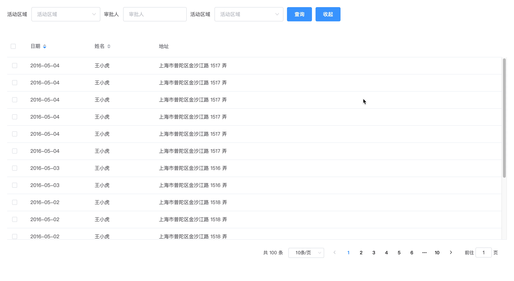
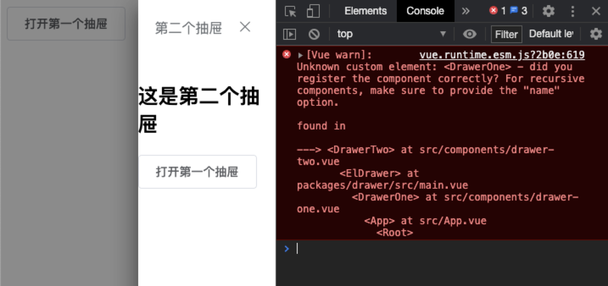
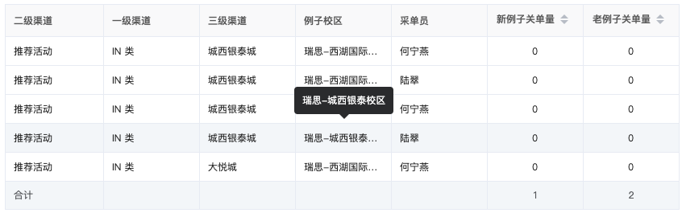

# Vue

## AntDesignVue自定义图片文件上组件

### 技术实现

```vue
<template>
  <div class="upload-wrapper">
    <a-upload
      ref="upload"
      list-type="picture-card"
      :accept="acceptStr"
      :file-list="fileList"
      @preview="handlePreview"
      @change="handleChange"
      :before-upload="beforeUpload"
      :remove="handleRemove"
      :customRequest="customRequest"
      :multiple="true"
      :disabled="disabled">
      <div v-if="isCanAdd">
        <a-icon type="plus" />
        <div class="ant-upload-text">
          上传
        </div>
      </div>
    </a-upload>
  </div>
</template>

<script>
import { upload } from '@/api/common'
import _ from 'lodash'

function getBase64(file) {
  return new Promise((resolve, reject) => {
    const reader = new FileReader()
    reader.readAsDataURL(file)
    reader.onload = () => resolve(reader.result)
    reader.onerror = (error) => reject(error)
  })
}
export default {
  props: {
    fileObjList: String,
    disabled: [Boolean],
  },
  watch: {
    fileObjList: {
      handler(val) {
        let arr = val ? JSON.parse(val) : []
        if (arr.length) {
          let sessionId = localStorage.getItem('sessionId')
          arr.forEach((item) => {
            item.url += `?sessionId=${sessionId}`
          })
        }
        this.fileList = arr
      },
      immediate: true,
    },
  },
  data() {
    return {
      fileListLength: 9,
      previewVisible: false,
      previewImage: '',
      fileList: [],
      newFileList: [],
      acceptStr: 'image/png,image/jpg,image/jpeg,\n' +
                 'application/vnd.openxmlformats-officedocument.presentationml.presentation,\n' +
                 'application/vnd.ms-powerpoint,\n' +
                 'application/vnd.ms-excel,\n' +
                 'application/vnd.openxmlformats-officedocument.spreadsheetml.sheet,\n' +
                 'application/msword,\n' +
                 'application/vnd.openxmlformats-officedocument.wordprocessingml.document,\n' +
                 'application/pdf,\n' +
                 'ext/plain',
    }
  },
  computed: {
    isCanAdd() {
      if (this.disabled) {
        return false
      } else if (this.fileList.length >= this.fileListLength) {
        return false
      } else {
        return true
      }
    },
  },
  methods: {
    clearUpload() {
      this.fileList = []
    },
    // 自定义上传
    customRequest(data) {
      this.upload(data)
    },
    // 取消预览
    handleCancelPreview() {
      this.previewVisible = false
    },
    // 预览
    async handlePreview(file) {
      if (!file.url && !file.preview) {
        file.preview = await getBase64(file.originFileObj)
      }
      this.previewImage = file.url || file.preview
      this.previewVisible = true
      window.open(file.url)
    },

    beforeUpload(file) {
      const isLt2M = file.size / 1024 / 1024 < 5
      if (!isLt2M) {
        this.$message.error('上传文件大小不可超过5M!')
        return false
      }
    },
    handleChange() {
      // console.log(info,'info')
      // console.log(file, "file");
      // this.fileList = fileList;
      // console.log(fileList, 'fileList')
    },
    // 删除
    handleRemove(file) {
      console.log(file, 'file')
      this.fileList = this.fileList.filter((item) => item.uid !== file.uid)
      this.newFileList = this.newFileList.filter((item) => item.uid !== file.uid)
      this.$emit('uploadSuccess', this.newFileList)
    },
    // 上传
    async upload(data) {
      const formData = new FormData()
      formData.append('file', data.file)
      data.onProgress()

      const { code, rs } = await upload(formData)
      if (code === 200) {
        data.onSuccess() //上传成功
        this.newFileList = []
        let fileFormate = this.fileFormatter(rs.name, rs.url)
        this.fileList.push(fileFormate)
        this.fileList.forEach((item) => {
          let { uid, name, url } = item
          this.newFileList.push({ uid, name, url: url.split('?')[0] })
        })
        this.$emit('uploadSuccess', this.newFileList)
      } else {
        data.onError() //上传失败
      }
    },

    // 图片格式化
    fileFormatter(name, url) {
      let sessionId = localStorage.getItem('sessionId')
      let file = {
        uid: _.uniqueId(),
        name: name,
        url: url + `?sessionId=${sessionId}`,
      }
      return file
    },
  },
}
</script>

```

## ElementUI table+分页封装

### 技术实现

table.vue

```vue
<template>
  <div class="table-wrapper">
    <el-table ref="table" v-bind="$attrs" v-on="$listeners">
      <slot name="columns"></slot>
    </el-table>
    <div class="pagination-wrapper">
      <el-pagination v-bind="$attrs" v-on="$listeners"></el-pagination>
    </div>
  </div>
</template>

<script>
export default {
  data() {
    return {}
  },
  computed: {},
  mounted() {
    console.log(this.$attrs)
    console.log(this.$listeners)
  },
  methods: {},
}
</script>
<style>
.pagination-wrapper {
  text-align: right;
  padding: 20px;
}
</style>

```

使用：

```vue
<template>
  <div id="app">
    <MyTable
      ref="multipleTable"
      :data="this.tableData"
      :tooltip-effect="'dark'"
      :default-sort="{ prop: 'date', order: 'descending' }"
      @selection-change="handleSelectionChange"
      :current-page="pagination.currentPage"
      :page-size="pagination.pageSize"
      :total="pagination.total"
      :layout="pagination.layout"
      @size-change="handleSizeChange"
      @current-change="handleCurrentChange">
      <template slot="columns">
        <el-table-column type="selection" width="55"> </el-table-column>
        <el-table-column prop="date" label="日期" sortable width="180"> </el-table-column>
        <el-table-column prop="name" label="姓名" sortable width="180"> </el-table-column>
        <el-table-column prop="address" label="地址"> </el-table-column>
      </template>
    </MyTable>
  </div>
</template>

<script>
import MyTable from './components/table'
export default {
  components: {
    MyTable,
  },
  data() {
    return {
      tableData: [
        {
          date: '2016-05-02',
          name: '王小虎',
          address: '上海市普陀区金沙江路 1518 弄',
        },
        {
          date: '2016-05-04',
          name: '王小虎',
          address: '上海市普陀区金沙江路 1517 弄',
        }
      ],
      multipleSelection: [],
      pagination: {
        currentPage: 1,
        pageSize: 10,
        layout: 'total, sizes, prev, pager, next, jumper',
        total: 100,
      },
    }
  },
  methods: {
    handleSelectionChange(val) {
      this.multipleSelection = val
    },
    handleSizeChange(val) {
      console.log(val)
    },
    handleCurrentChange(val) {
      console.log(val)
    },
    handleShow() {
      this.show = !this.show
    },
  },
}
</script>
```

## ElementUI table表格自适应

### 技术实现



使用指令的方式：

adaptive.js

```js
import { addResizeListener, removeResizeListener } from 'element-ui/src/utils/resize-event'

const doResize = async (el, binding, vnode) => {
  const { componentInstance: $table } = await vnode
  const { value } = binding
  if (!$table.height) {
    throw new Error(`el-$table must set the height. Such as height='100px'`)
  }
  const bottomOffset = (value && value.bottomOffset) || 30
  if (!$table) return
  const height = window.innerHeight - el.getBoundingClientRect().top - bottomOffset
  $table.layout.setHeight(height)
  $table.doLayout()
}

export default {
  bind(el, binding, vnode) {
    el.resizeListener = async () => {
      await doResize(el, binding, vnode)
    }
    addResizeListener(el, el.resizeListener)
    addResizeListener(window.document.body, el.resizeListener)
  },
  async inserted(el, binding, vnode) {
    await doResize(el, binding, vnode)
  },
  unbind(el) {
    removeResizeListener(el, el.resizeListener)
  },
}

```

index.js

```js
import adaptive from './adaptive'

const install = function(Vue) {
  Vue.directive('adaptive', adaptive)
}

if (window.Vue) {
  window['adaptive'] = adaptive
  // eslint-disable-next-line no-undef
  Vue.use(install)
}

adaptive.install = install
export default adaptive

```

全局引用：

main.js

```js
import adaptive from '@/directive/index'
Vue.use(adaptive)
```

单页面使用：

```js
import adaptive from '@/directive/index'
export default {
  directives: { adaptive },
  // 其他...
}
```

## ElementUI弹窗组件简单封装

### 技术实现

dialog.vue

```vue
<template>
  <el-dialog title="提示" :visible="visible" width="30%" :before-close="handleCloseDialog">
    <el-form :inline="true" :model="formInline" class="demo-form-inline">
      <el-form-item label="审批人">
        <el-input v-model="formInline.user" placeholder="审批人"></el-input>
      </el-form-item>
      <el-form-item label="活动区域">
        <el-select v-model="formInline.region" placeholder="活动区域">
          <el-option label="区域一" value="shanghai"></el-option>
          <el-option label="区域二" value="beijing"></el-option>
        </el-select>
      </el-form-item>
      <el-form-item>
        <el-button type="primary">查询</el-button>
      </el-form-item>
    </el-form>
    <span slot="footer" class="dialog-footer">
      <el-button @click="handleCloseDialog">取 消</el-button>
      <el-button type="primary" @click="handleConfirm">确 定</el-button>
    </span>
  </el-dialog>
</template>
<script>
export default {
  props: {
    visible: Boolean,
  },
  data() {
    return {
      formInline: {
        user: '',
        region: '',
      },
    }
  },
  mounted() {
    // mounted的操作
    // ...
    console.log('mounted')
  },
  destroyed() {
    console.log('destroyed')
  },
  methods: {
    // 关闭弹窗
    handleCloseDialog() {
      this.$emit('update:visible', false)
      this.$emit('handleCloseDialog')
    },
    // 确定弹窗
    handleConfirm() {
      this.$emit('handleConfirm', this.formInline)
      this.handleCloseDialog()
    },
  },
}
</script>

```

app.vue

```vue
<template>
  <div id="app">
    <Dialog :visible.sync="visible" v-if="visible" @handleConfirm="handleConfirm" @handleCloseDialog="handleCloseDialog" />
    <el-button @click="handleClick">打开弹窗</el-button>
  </div>
</template>

<script>
import Dialog from './components/dialog'
export default {
  components: {
    Dialog,
  },
  data() {
    return {
      visible: false,
    }
  },
  methods: {
    handleClick() {
      this.visible = true
    },
    handleConfirm(data) {
      console.log(data)
    },
    handleCloseDialog() {},
  },
}
</script>
```

::: tip 说明

1. 引用组件时，加上`:visible.sync="visible"`,组件内部是否使用修饰符`.sync`无所谓
2. 关闭组件时，使用`this.$emit('update:visible', false)`
3. 为了能够使用`mounted`,引用组件时，加上`v-if="visible"`，这样在关闭弹窗时，弹窗组件会销毁
:::

## 循环组件引用

### 业务场景

由于目前我们处理详情页面是使用`抽屉`的方式，当`A详情页`注册`B详情页`，`B详情页`又注册`A详情页`时，出现了组件循环引用的场景

### 问题分析

app.vue

```vue
<template>
  <div id="app">
    <DrawerOne ref="drawerOne" />
    <el-button @click="handleClick">打开第一个抽屉</el-button>
  </div>
</template>

<script>
import DrawerOne from './components/drawer-one'
export default {
  components: {
    DrawerOne,
  },
  data() {
    return {}
  },
  mounted() {},
  methods: {
    handleClick() {
      this.$refs.drawerOne.handleVisible()
    },
  },
}
</script>
```

drawer-one.vue

```vue
<template>
  <el-drawer title="第一个抽屉" :visible.sync="visible" :before-close="handleClose" size="50%" append-to-body>
    <h1>这是第一个抽屉</h1>
    <el-button @click="handleClick">打开第二个抽屉</el-button>
    <DrawerTwo ref="drawerTwo" />
  </el-drawer>
</template>
<script>
import DrawerTwo from './drawer-two'

export default {
    components: { DrawerTwo },
  data() {
    return {
      visible: false,
      direction: 'rtl',
    }
  },
  methods: {
    handleVisible() {
      this.visible = true
    },
    handleClose() {
      this.visible = false
    },
    handleClick() {
      this.$refs.drawerTwo.handleVisible()
    },
  },
}
</script>

```

drawer-two.vue

```vue
<template>
  <el-drawer title="第二个抽屉" :visible.sync="visible" :direction="direction" :before-close="handleClose" append-to-body size="50%">
    <h1>这是第二个抽屉</h1>
    <el-button @click="handleClick">打开第一个抽屉</el-button>
    <DrawerOne ref="drawerOne" />
  </el-drawer>
</template>
<script>
import DrawerOne from './drawer-one'

export default {
  components: { DrawerOne },
  data() {
    return {
      visible: false,
      direction: 'rtl',
    }
  },
  methods: {
    handleVisible() {
      this.visible = true
    },
    handleClose() {
      this.visible = false
    },
    handleClick() {
      this.$refs.drawerOne.handleVisible()
    },
  },
}
</script>

```

::: warning

1. 当点击`打开第二个抽屉`的按钮时，`抽屉二`正常打开，但是控制台报 `DrawerOne`组件未注册
:::



### 解决方案

drawer-one.vue

```vue
<template>
  <el-drawer title="第一个抽屉" :visible.sync="visible" :before-close="handleClose" size="50%" append-to-body>
    <h1>这是第一个抽屉</h1>
    <el-button @click="handleClick">打开第二个抽屉</el-button>
    <DrawerTwo ref="drawerTwo" />
  </el-drawer>
</template>
<script>
// import DrawerTwo from './drawer-two'

export default {
  //   components: { DrawerTwo },
  data() {
    return {
      visible: false,
      direction: 'rtl',
    }
  },
  beforeCreate() {
    // 解决循环抽屉打开，显示组件未注册的问题
    this.$options.components.DrawerTwo = () => import('./drawer-two')
  },
  methods: {
    handleVisible() {
      this.visible = true
    },
    handleClose() {
      this.visible = false
    },
    handleClick() {
      this.$refs.drawerTwo.handleVisible()
    },
  },
}
</script>

```

## 编程式导航实现新窗口打开

### 业务场景

vue项目，新开tab窗口，并携带参数

### 技术实现

```js
let routeData = this.$router.resolve({
    path: '/erp/contract/info',
    query: {
        name: 'luguanrui',
        age: 6
    },
})
window.open(routeData.href, '_blank');
```

## 弹窗关闭初始化数据

### 业务场景

当使用`弹窗`或者`抽屉`提交`form`表单的之后，手动关闭弹窗不会清空数据

### 技术实现

```js
Object.assign(this.$data, this.$options.data())
```

## vue绑定值与字符串拼接

### 业务场景

使用`ElementUI`遍历一个`tabs`数组，为每个`tab`标签页的选项卡头设置显示文字，要求添加上序号,并从1开始

### 技术实现

```vue
<a-tabs type="card" size="small">
    <a-tab-pane :key="index" :tab="`标签${index+1}`" v-for="(item, index) in list">
    </a-tab-pane>
</a-tabs>
```

::: warning 
如果使用`:tab="'标签' + index+1}"`这种方式，会编译成`标签01`这种形式
:::

## 动态表格

### 业务场景

- 表格中的列由后台配置生成
- 列的排序也有后台定义，且由后台来排序
- 合计也由后台来计算

### 效果图



### 技术实现

- 使用ElementUI 的 table
- 通过接口返回的列字段遍历匹配到每个prop

```vue
<template>
  <div id="app">
    <el-table
      class="my-table"
      :data="tableData"
      border
      :header-cell-class-name="() => 'my-table__header-th'"
      :summary-method="getSummary"
      @sort-change="sortChange"
      show-summary
    >
      <el-table-column
        v-for="col in cols"
        :key="col.prop"
        :prop="col.prop"
        :label="col.label"
        :sortable="col.sortable ? 'custom' : false"
        class-name="my-table__td"
        :align="!col.sortable ? 'left' : 'center'"
        show-overflow-tooltip
        :min-width="100"
      ></el-table-column>
    </el-table>
  </div>
</template>

<script>
const SORT = {
  ascending: 'asc',
  descending: 'desc',
}
export default {
  name: 'app',
  data() {
    return {
      tableData: [
        {
          DIM_004400: '推荐活动',
          DIM_004500: 'IN 类',
          DIM_004700: '城西银泰城',
          DIM_007400: '瑞思-西湖国际校区',
          DIM_011500: '何宁燕',
          OBJ_ODI_000109: '0',
          OBJ_ODI_000110: '0',
        },
        {
          DIM_004400: '推荐活动',
          DIM_004500: 'IN 类',
          DIM_004700: '城西银泰城',
          DIM_007400: '瑞思-西湖国际校区',
          DIM_011500: '陆翠',
          OBJ_ODI_000109: '0',
          OBJ_ODI_000110: '0',
        },
        {
          DIM_004400: '推荐活动',
          DIM_004500: 'IN 类',
          DIM_004700: '城西银泰城',
          DIM_007400: '瑞思-城西银泰校区',
          DIM_011500: '何宁燕',
          OBJ_ODI_000109: '0',
          OBJ_ODI_000110: '0',
        },
        {
          DIM_004400: '推荐活动',
          DIM_004500: 'IN 类',
          DIM_004700: '城西银泰城',
          DIM_007400: '瑞思-城西银泰校区',
          DIM_011500: '陆翠',
          OBJ_ODI_000109: '0',
          OBJ_ODI_000110: '0',
        },
        {
          DIM_004400: '推荐活动',
          DIM_004500: 'IN 类',
          DIM_004700: '大悦城',
          DIM_007400: '瑞思-西湖国际校区',
          DIM_011500: '何宁燕',
          OBJ_ODI_000109: '0',
          OBJ_ODI_000110: '0',
        },
      ],
      cols: [
        { label: '二级渠道', prop: 'DIM_004400' },
        { label: '一级渠道', prop: 'DIM_004500' },
        { label: '三级渠道', prop: 'DIM_004700' },
        { label: '例子校区', prop: 'DIM_007400' },
        { label: '采单员', prop: 'DIM_011500' },
        { label: '新例子关单量', prop: 'OBJ_ODI_000109', sortable: true },
        { label: '老例子关单量', prop: 'OBJ_ODI_000110', sortable: true },
      ],
      total: { value: '合计', OBJ_ODI_000109: 1, OBJ_ODI_000110: 2 },
    }
  },
  mounted() {},
  methods: {
    // 排序
    sortChange({ column, prop, order }) {
      console.log(SORT[order])
    },
    // 合计
    getSummary(params) {
      let { columns } = params
      let sums = []
      columns.map((column, index) => {
        if (index === 0) {
          sums[index] = this.total.value
          return
        }
        if (this.total.hasOwnProperty(column.property)) {
          sums[index] = this.total[column.property]
        } else {
          sums[index] = ''
        }
      })
      return sums
    },
  },
}
</script>

<style scoped>
/* 全局样式 */
.my-table {
  width: 100%;
  color: #262626;
  font-size: 12px;
}
/* td样式 */
.my-table /deep/ .my-table__td {
  padding: 0;
  height: 36px;
}
/* th样式 */
.my-table /deep/ .my-table__header-th {
  height: 40px;
  background: #fafafb;
  color: rgba(0, 0, 0, 0.65);
}
</style>

```

::: warning 问题
合计如果放置到顶部会与fixed定位冲突
:::

## keep-alive的真实场景应用

### 业务场景

由于列表页面需要用户筛选的条件太多，从列表页进入详情页，在从详情页返回到列表页时，数据刷新，这样就造成了用户需要重新去选择筛选条件（要求列表页面跳转详情页，返回时列表页面数据和滚动位置缓存）

### 需求

1. 从详情页返回列表页时保留用户选择和填写的数据
2. 页面停留在原来滚动的位置
3. 在详情页对单条数据进行操作之后，要求返回列表页时，只更新单条数据的的信息

### 问题分析

组件切换时，DOM重新渲染，导致数据刷新

### 技术方案

1. 使用vue的内置组件keep-alive，将状态保存在内存中，防止重复渲染DOM,结合router的meta属性，缓存部分页面
2. 使用keep-alive生命周期钩子函数：activated，更新单条数据
3. 进入详情页面时，缓存DOM元素的scrollTop，返回重新设置scrollTop解决页面返回时滚动的位置

### 具体实现

1. main.vue页面

```vue
<router-view/>
```

替换为：

```vue
<keep-alive>
    <router-view v-if="$route.meta.keepAlive"></router-view>
</keep-alive>
<router-view v-if="!$route.meta.keepAlive"></router-view>
```

2. 设置需要缓存路由的keepAlive属性

```js
{
    path: '/list',
    component: list,
    meta: {
    keepAlive: true,
    refresh: false,
    id: ''
    },
    beforeEnter: (to, from, next)=> {
    // 判断是不是从详情页返回的
    if (from.path === '/detail') {
        to.meta.keepAlive = true
        to.meta.refresh = true
        to.meta.id = from.query.id
    }
    next()
    }
},
```

3. 设置页面的srollTop并更新单条数据

```js
// 从例子详情页返回，更新本条例子信息
activated() {
if (this.$route.meta.refresh) {
    // 滚动到原来的位置
    let scrollToTop = JSON.parse(sessionStorage.getItem('scrollToTop'))
    document.getElementsByClassName('container')[0].scrollTop = scrollToTop

    // 遍历更新
    let id = this.$route.meta.id
    getListDetail({id: id}).then((res) => {
    let {code, data} = res
    if (code === 200) {
        this.data.forEach((val, i) => {
        if (val.id === id) {
            this.data[i] = Object.assign(this.data[i], data)
        }
        })
    }
    })
}
}
```
4. 进入详情页时缓存dom元素的scrollTop
```js
// 查看详情
_handleDetail(id) {
    let scrollToTop = document.getElementsByClassName('container')[0].scrollTop
    sessionStorage.setItem('scrollToTop', scrollToTop)
}
```

## 前端分页

### 业务场景

选择课程之后，可以通过选择自定义的优惠活动来为该课程减免优惠

### 需求

1. 由于优惠活动并不多，后端会返回全部的优惠活动，由前端实现分页，每页5条数据
2. 要求，点击 `选择优惠活动` 按钮，调用后台接口，重新获取一下优惠活动，保证优惠活动的时效性
3. 已经选择的优惠活动，不能重复选择，实现效果：选择优惠活动列表中一个优惠活动之后，优惠活动列表中就动态的减少该活动
4. 已选择的优惠活动可以删除，删除完了之后，优惠活动中改活动要动态的添加进来
5. 最多可以选择5个活动

### 实现

页面：

```vue
<template>
  <div class="home">
    <div style="text-align: left;margin: 20px">
      <el-button @click="handleClick" v-if="chooseList.length<5">选择优惠活动</el-button>
    </div>
    <el-table :data="chooseList" border :header-cell-style="headerCellStyle" style="width: 100%">
      <el-table-column prop="title" label="名称" min-width="150" align="center"></el-table-column>
      <el-table-column label="内容" prop="value" min-width="150" align="center"></el-table-column>
      <el-table-column label="操作" align="center" width="80">
        <template slot-scope="scope">
          <el-button size="small" @click="handleDelete(scope.row.id)">删除</el-button>
        </template>
      </el-table-column>
    </el-table>
    <dialog-list :dataList="dataList" @chooseData="chooseData"></dialog-list>
  </div>
</template>

<script src="./index.js"></script>
<style>
  .home {
    width: 700px;
  }
</style>
```

js文件

```js
import { getData } from '@/api/index'
import dialogList from '@/components/dialog-list/index.vue'
import { mapActions } from 'vuex'

export default {
  data() {
    return {
      dataList: [],
      chooseList: [],
      headerCellStyle: {
        backgroundColor: '#f5f7fa',
        lineHeight: '30px',
        padding: '5px 0'
      },
    }
  },
  components: {
    dialogList
  },
  created() {

  },
  methods: {
    ...mapActions(['setShow']),
    // 点击添加
    handleClick() {
      this._getData()
      this.setShow(true)
    },
    // 删除选择的list
    handleDelete(id) {
      this.chooseList.map((v, i) => {
        if (v.id === id) {
          this.chooseList.splice(i, 1)
        }
      })
    },
    // 获取list
    _getData() {
      getData().then(res => {
        let {code, rs} = res.data
        if (code === 200 && rs.length > 0) {
          // 默认this.dataList是存在
          this.dataList = rs
          if (this.chooseList.length > 0) {
            // 遍历已选择的列表
            for (let i = 0; i < this.chooseList.length; i++) {
              // 遍历数据列表
              for (let j = 0; j < this.dataList.length; j++) {
                // 过滤数据列表中的id与已选择的列表相同id的数据
                this.dataList = this.dataList.filter(v => {
                  return v.id !== this.chooseList[i].id
                })
              }
            }
          }
        }
      })
    },
    // 选择列表
    chooseData(val) {
      this.chooseList.push(val)
    }
  }
}
```

弹窗页面：

```vue
<template>
  <!--营销活动列表-->
  <el-dialog
    :visible="show"
    width="500"
    :closeOnClickModal="false"
    @close="handleClose">
    <div slot="title"><h3>优惠列表</h3></div>
    <div class="content">
      <el-table
        border
        :data="computedData"
        :header-cell-style="headerCellStyle"
        style="width: 100%">
        <el-table-column width="70" align="center" label="选中">
          <template slot-scope="scope">
            <el-radio v-model="chooseData"
                      @change="handleChoose"
                      :label="scope.row"
                      style="margin-right: -15px">&nbsp;
            </el-radio>
          </template>
        </el-table-column>
        <el-table-column min-width="120" align="center" label="名称" prop="title"></el-table-column>
        <el-table-column min-width="120" align="center" label="内容" prop="value"></el-table-column>
      </el-table>
      <!-- 分页 -->
      <div style="text-align: right;margin-top: 20px;">
        <el-pagination
          background
          :layout="layout"
          :current-page="currentPage"
          :total="dataList.length"
          :page-size="pageSize"
          @current-change="handleCurrentChange"
          @prev-click="handlePrev"
          @next-click="handleNext"
        ></el-pagination>
      </div>
    </div>
    <span slot="footer" class="dialog-footer">
      <el-button type="primary" @click="handleConfirmChoose" size="small">确定</el-button>
      </span>
  </el-dialog>
</template>

<script src="./index.js"></script>
```

js文件

```js
import { mapGetters, mapActions } from 'vuex'

export default {
  props: {
    dataList: {
      default() {
        return []
      }
    }
  },
  data() {
    return {
      layout: 'total,prev, pager, next',
      currentPage: 1,   // 当前页
      pageSize: 5,// 每页多少条数据

      chooseData: {}, // 当前选择
      headerCellStyle: {
        backgroundColor: '#f5f7fa',
        lineHeight: '30px',
        padding: '5px 0'
      },
    }
  },
  computed: {
    ...mapGetters(['show']),
    // 分页
    computedData() {
      return this.dataList.slice((this.currentPage - 1) * this.pageSize, this.currentPage * this.pageSize)
    }
  },
  methods: {
    ...mapActions(['setShow']),
    // 当前页
    handleCurrentChange(num) {
      this.currentPage = num
      this.$emit('handleCurrentChange', num)
    },
    // 上一页
    handlePrev(num) {
      this.currentPage = num
      this.$emit('handlePrev', num)
    },
    // 下一页
    handleNext(num) {
      this.currentPage = num
      this.$emit('handleNext', num)
    },
    // 关闭弹窗
    handleClose() {
      this.setShow(false)
    },
    // 选择
    handleChoose(val) {
      this.chooseData = val
    },
    // 确定选择
    handleConfirmChoose() {
      // 是否选择
      if (Object.keys(this.chooseData).length > 0) {
        this.setShow(false)
        // 将选择的到父级组件中
        this.$emit('chooseData', this.chooseData)
        // 清空选择
        this.chooseData = {}
      } else {
        this.$Message.error('请选择优惠活动')
        return
      }
    },
  }
}
```

vuex省略...

核心代码：

```js
computedData() {
    return this.dataList.slice((this.currentPage - 1) * this.pageSize, this.currentPage * this.pageSize)
}
```

### Q&A

1. ElementUI的dialog组件，使用visible属性绑定的变量位于vuex的store内，使用.sync不会正常工作
，还会报错`[Vue warn]: Computed property "xxx" was assigned to but it has no setter.`,此时需要去除 .sync 修饰符
2. 复杂业务拓展，使用的优惠券的类型的冲突，比如使用了`type === 1`就不能使用`type === 2`
